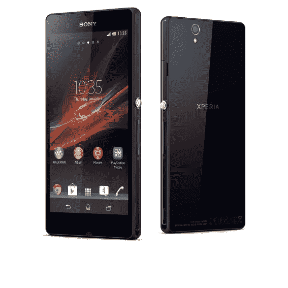
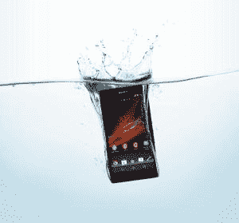
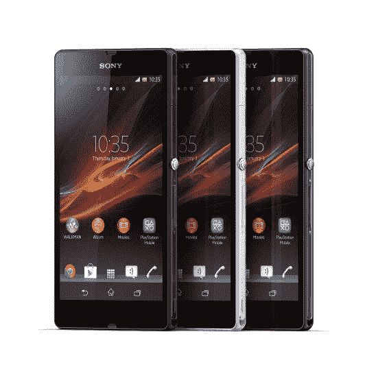

# 认识一下 5 英寸四核 Xperia Z:索尼对 iPhone 5 和 Galaxy S3 的惊人回应 

> 原文：<https://web.archive.org/web/https://techcrunch.com/2013/01/07/meet-the-5-inch-quad-core-xperia-z-sonys-stunning-answer-to-the-iphone-5-and-galaxy-s3/>

索尼在今天的 CES 新闻发布会上宣布了其首款四核智能手机:Xperia Z。该公司将希望这款新的 Android 旗舰产品能够提供高端竞争对手设备的头皮，如三星的 Galaxy S3 和苹果的 iPhone 5。4G 手机采用对称的矩形平板设计，线条简洁，前后都是平板玻璃，边缘钝圆，圆角最小。

索尼智能手机近年来在竞争中表现不佳，其移动业务主管在秋天承认了这一点。但这家日本电子制造商似乎决心整顿自己的手机业务，首先是 2011 年[收购其瑞典另一半爱立信](https://web.archive.org/web/20221210000951/https://beta.techcrunch.com/2011/10/26/sony-will-buy-out-ericssons-stake-in-handset-venture-for-1-47-billion/)——接着是去年 CES 上[第一款纯索尼品牌手机](https://web.archive.org/web/20221210000951/https://beta.techcrunch.com/2012/01/12/hands-on-with-the-sony-ericsson-xperia-s-from-ces/)(Xperia S)。

今年，索尼凭借其首款四核旗舰产品和首款 5 英寸屏幕手机提升了游戏水平，这也是它必须做到的。Xperia Z 是本月早些时候泄露的[“宇迦”设备](https://web.archive.org/web/20221210000951/https://beta.techcrunch.com/2013/01/01/per-these-leaked-ces-pics-sony-is-actually-capable-of-making-a-memorable-android-phone/)。索尼还推出了一款名为 Xperia ZL(又名“Odin”)的变种，它的工业设计/形状略有不同，有一个弯曲的塑料背部，以“更容易握在手中”，它不防水，但在其他方面是相同的硬件。不过，不要分心:索尼将对 Xperia Z 叫嚣得最大声，称它是 2013 年在大多数市场(包括西欧和日本)的“主要”和“领先”设备。

以下是 Xperia Z 的主要规格:

*   1.5 GHz 骁龙 S4 专业四核处理器
*   1080p 高清 5 英寸显示屏
*   安卓 4.1
*   4G/LTE
*   2GB 内存
*   13.1MP 后置摄像头；220 万像素前置摄像头
*   国家足球联盟
*   防水防尘
*   尺寸:139 x 71 x 7.9mm 毫米
*   电池 2，330 毫安时
*   最高 16GB 内存；通过 microSD 卡插槽可扩展(最高 32GB)

索尼仍然对其去年的产量说三道四，显然想从头开始——从头开始。索尼 Xperia 营销项目主管 Calum MacDougall 对 TechCrunch 表示:“爱立信的收购进行得如此之快，实际上，我们并没有真正做好准备成为更广泛的索尼家族的一部分/完全融入索尼家族。”。“但我们认为这款设备是真正的索尼智能手机向前迈出的一大步。它结合了索尼的最佳产品。”

### 五金器具

凭借 5 英寸显示屏，三星通过其 Galaxy Note 系列和旗舰产品 Galaxy S3 等设备推动的超大手机趋势没有超过索尼。但是，尽管包装了一个巨大的屏幕，这款手机感觉相对轻便(146 克)，易于管理，只有 7.9 毫米厚。它比 iPhone 5 厚一点，但比 Galaxy S3 薄。它还有一种高级感，这要归功于前后的钢化玻璃面板(不，你不能拆下电池)。

索尼将其全部注意力集中在全高清(1920 x 1080)屏幕上，包括其 Reality Display TV tech 和 Mobile Bravia Engine 2——前者使屏幕比一些超饱和的 AMOLED 智能手机屏幕具有更真实的色偏，后者旨在改善非高清镜头的观看效果(通过锐化和增加内容的饱和度——使其更加生动和提高清晰度)。像素密度异常清晰，为 443 ppi，所以如果你想要一个在旅途中观看电影和电视节目的设备，Xperia Z 应该不会令人失望。 

谈到 1300 万像素的摄像头，索尼 Exmor RS 移动成像传感器提供了改进的弱光性能，并支持视频 HDR——据该公司称，这是智能手机的第一次。前置镜头采用索尼的 Exmor R 传感器。

在其他地方，索尼增加了非接触式传输/支付技术 NFC，该技术继续努力获得消费者的青睐，但至少可以与扬声器等 NFC 外设配对。(索尼还在 CES 上推出了 NFC 和 [Miracast](https://web.archive.org/web/20221210000951/https://beta.techcrunch.com/2012/09/19/wi-fi-alliance-simplifies-streaming-with-miracast-certification-just-dont-expect-apple-to-play/) 功能的电视，这种电视将 NFC 芯片放在电视遥控器上，这样你就可以通过点击遥控器上的手机来分享智能手机上的内容。)

索尼现在完全是一家日本公司，它还让 Xperia Z 防水(防尘)——这是日本智能手机的一个非常常见的功能。

### 软件

在软件方面，Xperia Z 运行的是 Android 4.1 Jellybean，这有点令人失望，因为 Android 4.2 已经发布了。但索尼向我保证，它打算让 Xperia Z 升级到 4.2 和下一代 Android(代号为 Key Lime Pie)。在 Android 之上，Xperia Z 有一个轻量级的索尼用户界面，但幸运的是，该公司似乎正在学习，当涉及到 Android 时，越少越好。用户界面去掉了过去 Xperia 设备上的一些丑陋的小部件动画，在我短暂的使用过程中感觉很快很流畅。索尼表示，用户界面不是它想要强调的东西——它甚至没有给它一个品牌名称。

相反，索尼完全专注于宣传其多媒体服务，这些服务位于 Xperia Z: Walkman 的主要媒体应用程序中，用于音乐下载，并访问索尼的音乐无限流媒体服务(该服务提供 8000 万首歌曲，但前提是你必须按月付费)；视频内容的电影，包括进入索尼的视频无限商店租赁或购买电影；和 PlayStation Mobile 来访问索尼的游戏应用商店。还有一个相册应用程序，里面有照片，它还可以从你的脸书和 Picasa 账户中获取图片，并包括一个地理标记功能，可以绘制照片的拍摄地。

麦克杜格尔说:“苹果的最大优势是产品用户界面的一致性，所以我们知道，如果我们要提供一个更广泛的生态系统，我们必须与之匹配。”“我们打算为多种索尼产品提供统一的体验。这是为了在多种设备上提供一致的索尼娱乐体验。”

Xperia Z 还包括一个电池最大化模式，称为电池续航模式，可以将待机时间延长 4 倍(或更多)。它的工作原理是当手机屏幕关闭时，关闭所有后台应用程序，除了标准电话和短信。用户还可以将某些应用列入白名单，以确保它们在需要时仍能在后台运行。

索尼提供了三种颜色的 Xperia Z:黑色、白色和紫色(见下文)。确切的发布日期、市场和定价有待确认，但索尼表示，它计划在“2013 年 Q1”进行“全球发布”，并补充说最初的重点将是西欧。

