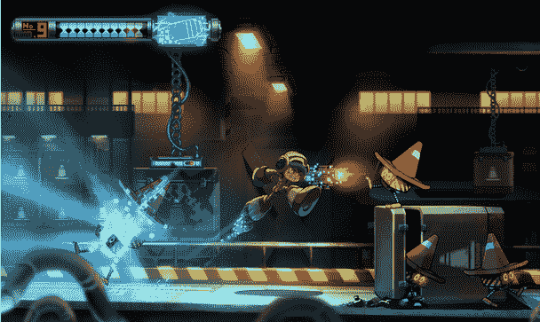
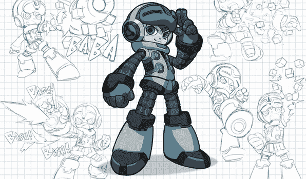

# 《超级男人》的创作者转向 Kickstarter 为他的新游戏(看起来很像《超级男人》)注入能量

> 原文：<https://web.archive.org/web/https://techcrunch.com/2013/09/01/mega-mans-creator-turns-to-kickstarter-to-fuel-his-new-game-which-looks-a-whole-lot-like-mega-man/>

在这一点上，它变得几乎公式化了:一个标志性的游戏设计师，在一群忠实粉丝的支持下，转向 Kickstarter，让他们自己爆发。请看:[蒂姆·斯查费](https://web.archive.org/web/20230327204957/https://techcrunch.com/2012/02/09/new-kickstarter-record-set-as-double-fine-game-hits-400k-in-8-hours-900k-in-16/) ( *猴岛*，*格里姆·范丹戈*)，他为他的工作室 DoubleFine 筹集了超过 300 万美元，或者[道格·坦纳佩尔](https://web.archive.org/web/20230327204957/https://techcrunch.com/2013/05/28/nostalgia-activate-earthworm-jims-creator-turns-to-kickstarter-for-his-gaming-comeback/) ( *蚯蚓吉姆*)，他筹集了不到 100 万美元来打造他的早期游戏 *The Neverhood* 的精神继承者。

最新一位转向大众的游戏巨头是稻船敬二，他是游戏界最经典的偶像之一《超级男人》的创造者。他的新游戏看起来和听起来都很像《超级男人》,这可能会让他的粉丝高兴(但可能不会是他的前老板)。

2010 年 10 月，Inafune 在 Capcom 工作了 23 年后公开退出该公司。“我要离开卡普空，打算重新开始我的生活，”他在博客上写道。

两个月后，他启动了一个名为 Comcept 的新开发工作室。

虽然 Inafune 从未公开直接称他的新游戏为《超级男人》的精神继承者，但他们也没有太努力(或者说，真的，根本没有)去隐藏这是一个尽可能多的精神继承者。我是说，拜托——看看这个描述:

> 你扮演贝克，一系列强大机器人中的第九个，也是唯一一个没有被神秘的计算机病毒感染的人，这种病毒已经导致全世界的机械化生物陷入疯狂。运行，跳跃，爆炸，并通过六个阶段(或更多，通过拉伸目标)改变你的方式，你可以以任何顺序解决你选择的问题，使用从你的敌人那里偷来的武器和能力来打倒你的同伴大量的机器人，并面对威胁地球的最终邪恶！

我们来看一下超级男人清单。人形机器人？检查。从你的敌人那里窃取特殊能力？检查。你可以按任何顺序通过关卡(大概是利用获得的能力来利用每个老板的弱点)？奇克。

请注意，这并不是一件对 T2 有害的事情。当然——如果我是 Capcom 的律师，我肯定会对这件事感到愤怒。但我不是。我只是一个从小玩《超级男人》长大的人，从 1995 年开始，我就一直在等待一款伟大的、现代化的《超级男人》游戏… *所以我等不及了。*

【YouTube http://www.youtube.com/watch?v=PX1o0so4anc？feature = player _ detail page & w = 640 & h = 360]

毫不奇怪，Inafune 新团队的血管里流淌着大量的 Mega Man/Capcom 血液。游戏的首席设计师，Naoya Tomita，为 Mega Man 1，2，5 和 6 做了很多设计。它的首席音乐家松前美也是创作出原版音乐和音效的作曲家。

*[威武九号](https://web.archive.org/web/20230327204957/http://www.kickstarter.com/projects/mightyno9/mighty-no-9)* 正试图在 Kickstarter 上融资 90 万美元。在短短 24 小时内筹集了超过 70 万美元，很明显他们会毫不费力地实现这一目标。唯一令人失望的是:无论他们多快实现目标，我们最早也要到 2015 年才能看到*第九名*。起初，他们只是承诺游戏将在 PC 上运行，尽管他们承诺如果筹集到足够的资金，将会把它移植到其他地方。