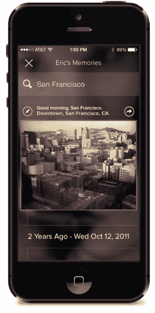
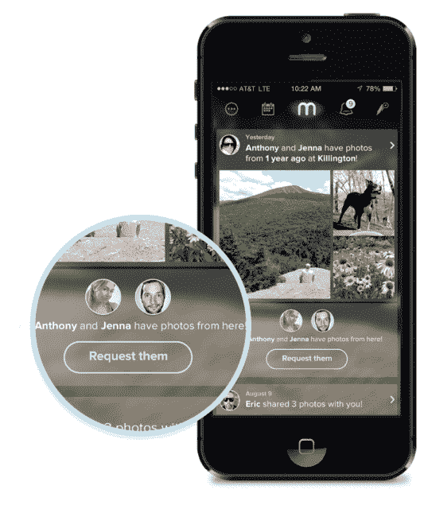

# 回忆录是照片记忆的“Google Now ”,是一款帮助你回忆过去的应用程序

> 原文：<https://web.archive.org/web/https://techcrunch.com/2013/09/18/memoir-for-ios-a-google-now-for-photo-memories-helps-you-remember-the-past/>

由于智能手机无处不在的普及，以及它们带来的拍照便利，我们的照片图库已经充满了几乎像一次性记忆一样的东西。我们抓拍并分享，但再也不会回来回忆。总部位于纽约的[回忆录](https://web.archive.org/web/20230324115539/http://www.yourmemoir.com/)是今天在 iOS first 上发布的一款新应用，它希望通过提供一种穿越过去的方式来改变这种情况，让你重新发现你以前去过的人、时间和地点，并把你和与你分享这些经历的人联系起来。

如果这个总体目标对你来说有点难以捉摸，那就把回忆录想象成一个照片分享工具。该应用程序要求访问你的照片库和位置，并连接到脸书、Instagram 和 Foursquare 等服务，以便对你以前拍摄的照片进行分组和组织。如果你想从电脑中导入你的整个照片档案，还有一个 Mac 实用程序。

 如果说 [Google Now](https://web.archive.org/web/20230324115539/http://www.google.com/landing/now/) 是一个主动搜索工具，在你查找之前提醒你需要知道的事情，比如航班时间或交通状况，那么回忆录就相当于照片分享。不像其他照片分享应用程序需要大量的体力劳动——创建和命名相册，标记朋友，管理画廊等。——回忆录只是挖掘了你过去所做的努力，无论多么微不足道。

你不必开始在手机上使用回忆录作为默认的相机应用程序来利用这项服务(尽管你可以这样做)。相反，当条件合适时，你可以选择被动地被通知你的照片记忆。

例如，如果你去了一家你很久没去过的最喜欢的餐馆，它会提醒你，并显示你在那里吃的美食的照片。或者如果你和一个很久没见的老朋友在一起，它可以让你想起你们最后一次在一起的时间和当时拍的照片。此外，与 Timehop 或 Everpix 等其他服务类似，回忆录让你回顾过去，看看几年前的同一天你在做什么。

虽然你当然可以在“设置好就忘了”的模式下使用回忆录，在这种模式下，你会等待你的记忆在正确的时刻被唤醒，但该应用程序也可以作为一种高级照片搜索工具。

由于[回忆录](https://web.archive.org/web/20230324115539/http://www.yourmemoir.com/)必须建立的联系比你典型的照片共享应用程序涉及更多的数据科学，它可以利用对谁、什么、何时、何地和其他背景(例如日历事件)的更深入理解来帮助你更好地搜索你的照片，允许高级查询，例如像*那次我和约翰和简在旧金山*。这实际上是一个强大的工具，而不是你今天在大多数照片分享应用程序中能找到的。

回忆录联合创始人兼首席执行官[李·霍夫曼](https://web.archive.org/web/20230324115539/http://www.crunchbase.com/person/lee-hoffman)解释说:“基本上，我们所做的就是获取所有这些小数据点——你曾经拍过的每张照片、位置、你曾经在社交网站上发布的任何东西、你的日历——我们正在制作这些有凝聚力的记忆，当这些记忆最怀旧时，我们会向你播放，并且以一种前所未有的方式进行搜索。”。

当你收到属于你朋友的照片记忆时，你也可以通过应用程序请求这些照片的副本，它会代表你通知你的朋友。该朋友然后可以启动回忆录来促进该请求。这是对共享相册概念的一种不同看法，近几个月来，许多初创公司都试图解决这一问题，包括 Flock(从 Bump，[，本周刚刚退出谷歌](https://web.archive.org/web/20230324115539/https://techcrunch.com/2013/09/16/bump-mobile-contact-sharing-app-acquired-by-google-will-stay-alive-for-now/))，以及 Cluster，Tracks，Albumatic，Flayvr 等其他公司，都取得了不同程度的成功。

回忆录也可以作为 iCloud 的替代品，将你所有的照片私下备份到它的服务器上。通过这种方式，它与 Loom 这样的初创公司以及 Flickr、Dropbox 以及 Google+和脸书这样也提供自动上传功能的大型照片分享和存储网站展开竞争。回忆录将免费备份 iPhone 分辨率的照片，但那些想保存高清副本或视频的人将不得不支付溢价(尚未设定)。

虽然价格很有竞争力，回忆录也有别于这个领域的其他公司，但如今很少有照片分享初创公司成为独立公司。许多人选择了行业巨头，比如 T2、谷歌、T4、脸书、Dropbox、雅虎、Shutterfly、或者干脆关门大吉。这一记录可能会让早期采用者犹豫是否信任这些具有像照片存储和检索这样有价值任务的应用程序，这反过来导致人们采用更像玩具而不是真正技术突破的照片应用程序。

由安吉拉·金(Angela Kim)和其他人共同创立的回忆录(Memoir)现在有大约六人的团队，为一个早期的概念筹集了 120 万美元的种子资金，这个概念与教育领域的照片分享无关，名为 T2 验证()。本轮投资者包括 Betaworks、SV Angel、Lerer Ventures、Thrive Capital、David Tisch、Joel Spolsky、Steve Cheney 等。

回忆录可以在 iTunes 上找到[。](https://web.archive.org/web/20230324115539/https://itunes.apple.com/us/app/memoir/id544754670?mt=8)