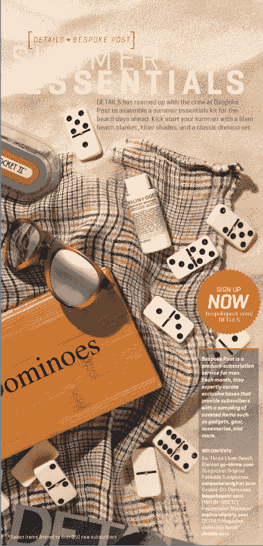

# 男士订阅服务 Bespoke Post 与 Details Mag 合作，获得 500 家初创公司的投资 

> 原文：<https://web.archive.org/web/https://techcrunch.com/2012/06/04/mens-subscription-service-bespoke-post-partners-with-details-mag-grabs-500-startups-as-investor/>

由于与康泰纳仕旗下的《细节》杂志(Details magazine)建立了新的合作伙伴关系，一家采用基于订阅的“每月一盒”模式的新电子商务初创公司 Bespoke Post 将于下周首次公开亮相。尽管这项服务从 4 月初就已经向公众开放，但细节方面的交易将把男性订阅俱乐部推向更广泛的受众。

该公司目前也在筹集 50 万美元的种子资金，我们被告知，这是一个半封闭的过程，有 500 家初创公司，OLX 的 Fabrice Grinda，IG Expansion 的若泽·马林和其他天使投资人。

作为纽约市[企业家圆桌会议加速器](https://web.archive.org/web/20221007042855/http://eroundtable.net/accelerator/) (ERA)的参与者，Bespoke Post 在第 11 个小时艰难地改变了最初的想法，即一个名为 Nabfly 的移动广告。据与史蒂夫·萨罗诺斯(Steve Szaronos)共同创建该公司的 Rishi Prabhu 称，Nabfly 有付费客户，但他们对这项业务没有热情。在距离 ERA 演示日不到一周的时候，团队改变了策略，Bespoke Post 诞生了。

虽然在 T4 拥挤的空间里玩，但 Prabhu 相信 Bespoke 的(有趣的标题)“令人敬畏的盒子”有机会成为基于订阅的商业中的佼佼者。

“男性在策划领域有很大的机会，”他说，“品牌也这么认为。”

 那么是什么让 Bespoke 的“牛逼之盒”如此……嗯，牛逼呢？首先，它不是样品，而是全尺寸的产品。费用合理——每月 45 美元，基本上相当于健身房会员。盒子是有主题的(最近的例子包括剃须套装、旅行主题和高端日式鸡尾酒套装)。此外，与许多订阅服务不同，你可以提前看到盒子里会有什么，然后选择是否在那个月跳过它。

盒子的零售价约为 70 美元，但 Bespoke 通过与品牌合作伙伴谈判来保持低成本，这些合作伙伴将此类服务视为营销渠道。然而，他说，Prabhu 指出，在某些东西上获得折扣并不自动意味着它会被装进盒子里。“我们的目标是把(我们的客户)变成世界上最有趣的人，一次一个盒子，”他说。这是一个涉及策划的过程，不仅由创始人，而且由一个专家小组来权衡考虑中的项目。

Prabhu 表示，Bespoke Post 的年化运营成本接近 100 万美元。(公司要求我们不要透露用户数量，但你可以自己算算)。他还声称流失率也很低——不到 5%,但同样，他不会透露细节。当然，说低流失率将永远如此还为时过早。没有人知道基于订阅的电子商务是否会持续下去，更不用说谁会是赢家(如果有的话)。

已经有各种各样的产品，如 Bespoke Post，旨在每个月提供意外的惊喜，但许多直接针对男性的服务都集中在单一的垂直领域，如服装、美容或其他必需品。

随着与细节的新协议，定制邮政将推出几个联合品牌的盒子，这些盒子也将出现在细节的印刷杂志的页面上。(见右图)。该公司表示，其他媒体资产和出版商将在未来几个月内排队。

感兴趣的用户可以在这里注册预约贴[。](https://web.archive.org/web/20221007042855/https://bespokepost.com/)