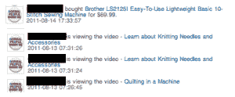

# 默塔多筹集 230 万美元；推出电视平台，将家庭购物带入社交网络 TechCrunch

> 原文：<https://web.archive.org/web/http://techcrunch.com/2011/09/14/mertado-raises-2-3-million-launches-tv-platform-to-bring-home-shopping-to-the-social-web/>

# 默塔多筹集 230 万美元；推出电视平台，将家庭购物带入社交网络

允许用户在脸书上寻找和购买产品的社交购物初创公司 Mertado 今天推出了“Mertado TV”，这是一款将生活视频内容与社交网络上的产品选择相结合的新产品。那是什么意思？Mertado TV 将提供来自 Food Network、Fine Living 和 Better TV 等网络的联合内容，以及 Mertado 目录中的特色产品——所有这些都通过舒适的脸书实现。

根据 Mertado 创始人兼首席执行官 Vijay Chittoor 的说法，Mertado 电视平台的测试表明，购物者在观看集成视频内容后，重复购买活动增加了 250%。随着[社交商务收入到 2015 年将增长到 300 亿美元](https://web.archive.org/web/20230204194407/http://www.internetretailer.com/2011/03/30/social-commerce-revenues-will-grow-sixfold-five-years)，这位首席执行官表示，这家初创公司的产品目录与顶级生活方式节目的整合将使他们处于一个可以看到曲棍球棒式增长的空间。

 在这里你可以看到一些 Mertado 用户的例子，他们与新的电视平台互动，并实际购买了一些东西。出于隐私考虑，我们已经模糊了用户名。

这家初创公司今天宣布完成了一轮 230 万美元的 A 轮融资，由 trust Canyon Partners 领投，目前的投资者 Blumberg Capital 和 Redpoint Ventures 也加入了融资。

Mertado 创始人兼首席执行官 Vijay Chittoor 表示:“我们的使命是向消费者展示一系列高品质、独特、面向生活方式的家居产品，无论他们在哪里度过时光。“将我们的产品目录与领先的在线社区
上的领先生活方式节目相结合，是真正创造有益的社交购物体验
的合乎逻辑的下一步——数字证明这是成功的。”

Booz & Company 估计，2015 年社交商务收入将达到 300 亿美元。为了推动
Mertado 通过 Mertado TV 的扩张，该公司还宣布完成了一轮 230 万美元的首轮融资。[乡村峡谷合伙人](https://web.archive.org/web/20230204194407/http://www.crunchbase.com/financial-organization/rustic-canyon-partners)加入了之前的投资者[布隆伯格资本](https://web.archive.org/web/20230204194407/http://www.crunchbase.com/financial-organization/blumberg-capital)和
[红点风险投资](https://web.archive.org/web/20230204194407/http://www.crunchbase.com/financial-organization/redpoint-ventures)。Blumberg Capital 董事总经理布鲁斯·塔拉金(Bruce Taragin)将加入 Mertado 董事会，作为本轮融资的一部分。

作为 YC 大学 2010 年春季班的校友，这家初创公司的首轮融资使总投资额达到 330 万美元。Mertado TV 目前已在[Mertado.com](https://web.archive.org/web/20230204194407/https://www.mertado.com/?spact=landing)推出，不久将在更多目的地推出，包括下个月在 Press Enterprise 的网络上推出。

Mertado TV [的推出遵循了这家初创公司最近的努力，即通过推出虚拟店面，创作者可以将其集成到他们的应用程序中，来帮助开发者从他们的社交游戏中赚更多的钱](https://web.archive.org/web/20230204194407/https://techcrunch.com/2010/10/26/mertado-social-games/)。

正如 Jason 在他对 Mertado 虚拟店面的报道中所写的，“当用户激活 Mertado 店面时，他们会看到一个小部件覆盖在他们正在玩的游戏之上。整个购物过程，从选择一件商品到用信用卡结账，都是通过这个小部件完成的，因此用户永远不会被踢到另一个页面(这对开发者来说是个好消息，他们希望自己继续玩游戏)”。

更多关于 Mertado TV 的信息，[请点击此处](https://web.archive.org/web/20230204194407/http://www.mertado.com/?spact=tv)访问主页。