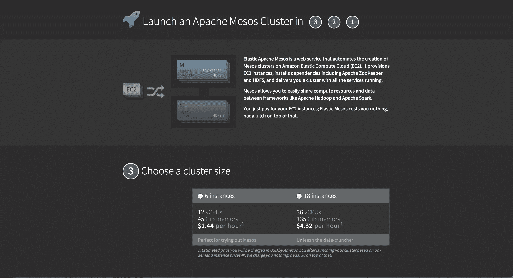

# Mesosphere 推出弹性 Mesos，使设置 Mesos 集群的过程分为三步 

> 原文：<https://web.archive.org/web/https://techcrunch.com/2013/11/12/mesosphere-launches-elastic-mesos-makes-setting-up-a-mesos-cluster-a-3-step-process/>

专注于开发 Mesos 的初创公司 meso sphere T1 今天发布了 T2 弹性 Mesos T3。这款新产品使在 Amazon Web Services 上设置 Mesos 集群成为一个基本的三步过程，它会询问您想要设置的集群的大小、您的 AWS 凭据以及一封电子邮件，您可以在邮件中获得关于集群状态的通知。

鉴于建立一个常规的 Mesos 集群的[复杂性](https://web.archive.org/web/20221007144005/http://mesos.apache.org/documentation/latest/ec2-scripts/)，这个新项目将使开发者更容易试验 Mesos 和 Mesosphere 以及其他人围绕它创建的框架。

正如 Mesosphere 的创始人 Florian Leibert 所描述的那样，对于许多应用程序来说，数据中心现在就是计算机。大多数应用程序现在运行在分布式系统上，但是连接所有的分布式部分通常仍然是一个手动过程。Mesos 的工作是抽象出所有这些复杂性，并确保应用程序可以将数据中心和所有节点视为一台计算机。Mesos 没有为应用程序的不同部分设置不同的服务器集群，而是创建了一个服务器共享池，可以根据需要动态分配资源。

目前的 Mesos 用户包括 Airbnb、Vimeo、Hubspot 和 Twitter。

尽管从长远来看，Mesos 简化了事情，但设置 Mesos 集群仍然很复杂，包括安装 [ZooKeeper](https://web.archive.org/web/20221007144005/http://zookeeper.apache.org/) 、 [Hadoop 分布式文件系统](https://web.archive.org/web/20221007144005/http://www-01.ibm.com/software/data/infosphere/hadoop/hdfs/) (HFDS)和其他软件包，然后连接所有这些部分。而且这还是在你可以安装像 [Chronos](https://web.archive.org/web/20221007144005/https://github.com/mesosphere/chronos) 、 [Hadoop](https://web.archive.org/web/20221007144005/https://github.com/mesos/hadoop) 、Marathon、Jenkins 等框架之前。

有了 Elastic Mesos，Mesosphere 可以在 15 分钟内为您在 AWS 上设置好所有这些。在当前的形式下，开发人员可以在 6 实例集群和 18 实例集群之间进行选择。Leibert 告诉我，以 AWS 目前的价格运行小版本应该需要大约每小时 1.44 美元，应该非常适合测试 Mesos，大版本(每小时 4.32 美元)应该足够大，可以在上面运行重要的应用程序。从长远来看，中间层可能会提供更灵活的配置选项。虽然 Mesos 本身通常可以通过简单地向集群添加新节点来扩展，但 Elastic Mesos 还没有这种能力，但 Mesosphere 正在努力实现这一点。

Mesosphere 本身正在免费提供这项服务。开发人员需要支付的唯一费用是他们的 AWS 实例。

一旦一切就绪，开发人员就可以在几分钟内在 Mesos(或任何其他 Mesos 框架)上运行 Hadoop 或 Spark。

Leibert 希望让 Mesos 实验变得更容易也能帮助那些想要编写自己的 Mesos 框架的开发人员。毕竟，他们通常没有一个数据中心供他们使用，只是为了试验像 Mesos 这样的新技术，但有了弹性 Mesos，他们可以只旋转一个集群，并开始测试他们的框架几个小时。