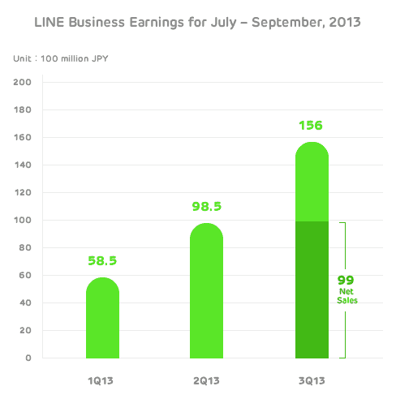

# 消息应用 Line 现在每季度带来近 1 亿美元的收入，但没有关于 IPO 的官方消息 

> 原文：<https://web.archive.org/web/https://techcrunch.com/2013/11/11/messaging-app-line/>

在过去两年半的时间里，即时通讯应用 Line 在日本风靡一时，现在[一个季度的收入接近 1 亿美元](https://web.archive.org/web/20221206104045/http://linecorp.com/en/press/2013/1107618)。

这款名为[的应用是其母公司 Naver](https://web.archive.org/web/20221206104045/http://www.serkantoto.com/2013/02/06/nhn-japan-line-corp/) 的子公司，该应用表示，在截至 9 月份的季度中，它带来了 99 亿日元(9990 万美元)的净销售额。包括 Line 必须向应用商店和开发者支付的金额在内的总收入在过去六个月中增长了一倍多，达到 156 亿日元(1.576 亿美元)。

虽然当地报纸已经报道了明年即将进行的首次公开募股，但该公司在周五的采访中对此保持沉默。但我们从与该公司关系密切的投资者处分别获悉，他们正在考虑在 2014 年年中上市。

“你当然会问关于首次公开募股的问题，”LINE 的首席战略和营销官 Jun Masuda 说。“这是我们正在考虑的策略，尤其是考虑像 Twitter 这样的服务。但目前，我们不认为这是我们必须马上做的事情。我们目前有足够的现金，我们并不迫切需要进行 IPO。”

Line 已经见证了 Naver 的 skunkworks 项目的惊人崛起，Naver 是韩国大型同名搜索门户网站的幕后公司。自 2011 年福岛核电站大地震后不久推出以来，Line 已经在全球积累了 2.8 亿注册用户。他们从未公布月活跃用户的数据。

这款应用在日本已经拥有 4900 万注册用户，彻底颠覆了日本的移动游戏市场，削弱了 DeNA 的 Mobage network 和 GREE 等游戏平台的历史影响力。这两家公司在功能手机时代占据统治地位，但 DeNA 的股票现在已经下跌了 32.5%，而 GREE 的股票在去年下跌了 41.5%。Line 的崛起，以及腾讯(Tencent)的微信(Weixin)等其他应用的崛起，显示出移动社交网络和即时通讯领域的持续动荡。

现在，Line 在游戏领域的势头越来越大，已经发布了 39 款游戏，并正在筹备交易，以将更多第三方游戏从国外引入日本市场。他们最近与芬兰的 Boomlagoon 达成协议，Boomlagoon 是一个由前《愤怒的小鸟》开发者团队组成的工作室。

在增加游戏平台之前，Line 一直在大力推广贴纸和赞助账户来获取收入。(值得注意的是，贴纸被脸书和 Path 等许多其他西方竞争对手复制)。

但现在，Line 收入大幅增长的关键部分是在游戏领域。Line 业务的游戏部分现在占其收入的 60%，其次是贴纸，占其销售额的 20%。然后是赞助账户和营销，这是非常少的。他们以游戏为中心的战略紧跟邻近的韩国消息应用 Kakao 在 Google Play 排行榜上占据主导地位的做法。根据 App Annie 的数据，【Kakao 在 Google Play 上发布了该国总收入最高的 10 个游戏。

像脸书一样，在推出其平台的早期，游戏收入也迅速增长，Line 希望不仅仅是一个游戏分销商。他们将自己视为一个通信平台，他们认为这将比 DeNA 的 Mobage 和 GREE 等纯游戏平台更持久。

“像我们这样的公司与 Mobage (DeNA)和 GREE 之间有着根本的区别，”他说。“他们的 SNS(社交网络服务)是基于游戏的，所以用户很容易迅速退出服务。但是 Line 是以沟通为基础的。用户每天都用它来免费通话和发信息，所以我们认为我们的寿命会比以前的社交网站更长。”

接下来，他们正在考虑建立某种类型的电子商务服务或市场，处理消费者对消费者和企业对消费者的交易。这可能会给乐天(Rakuten)等巨头和日本的许多其他小型电子商务初创公司带来竞争。

在日本市场饱和后，他们的大增长市场在台湾和泰国等国家。然后，他们将着眼于西班牙语或拉丁美洲市场，如墨西哥、西班牙和巴西，以寻求增长。

美国仍然是一个艰难且竞争异常激烈的市场，尽管他们雇佣了当地的美国高管，并且[与 Snoop Dogg](https://web.archive.org/web/20221206104045/http://en.lineblog.naver.jp/archives/19419881.html) 等艺术家合作，以增加那里的观众。

“我们已经考虑了一段时间进入美国的策略，但目前这是一个非常困难的市场，”增田说，拒绝透露该应用程序在美国有多少用户。

他说，尽管有微信(Weixin)或微信(WeChat)这样的新贵，但久负盛名的 WhatsApp 是他们最强有力的竞争对手，尤其是在印度这样的增长型市场。

他说，“你可以在网络连接不好的地方，或者在配置不是很高的智能手机上使用这个应用程序。”