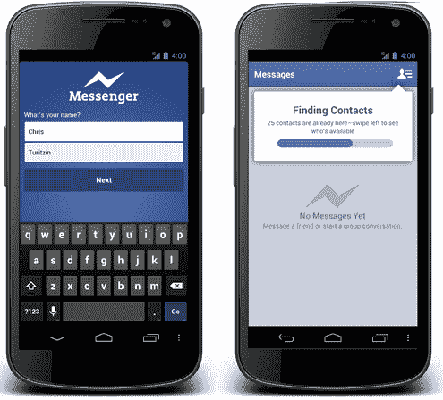

# 不需要脸书账号:Facebook Messenger For Android 让你只需一个电话号码就能注册

> 原文：<https://web.archive.org/web/https://techcrunch.com/2012/12/04/messenger-no-facebook-account/>

今天[脸书宣布](https://web.archive.org/web/20230326022426/http://newsroom.fb.com/News/544/A-New-Way-to-Sign-Up-for-Messenger-for-Android)它的第一个产品对没有脸书账户的人开放。从现在开始，Android 应用程序的 [Messenger，以及随后的 iOS 版本，将允许非脸书用户只需姓名和电话号码即可注册。脸书似乎已经意识到 Messenger 的局限性，并希望让您向您的联系人发送消息，无论他们是否加入了脸书。](https://web.archive.org/web/20230326022426/https://play.google.com/store/apps/details?id=com.facebook.orca)

面向非脸书用户的 Messenger 今天开始在有限的几个国家推出 Android 应用程序，包括印度、澳大利亚、印度尼西亚、委内瑞拉和南非，但很快将扩展到世界其他地区。iOS 版 Messenger 最终也将接受只需电话号码和姓名的注册，但脸书没有时间表。脸书移动产品经理 Peter Deng 将于今天晚些时候在 LeWeb 的舞台上正式公布这一更新。

当非脸书用户注册时，该应用程序会吸收他们的联系人。然后，可以通过名称选择它们来启动消息或组消息线程。扩大覆盖范围将有助于脸书挑战短信，以及第三方免费短信应用，如 [Pinger](https://web.archive.org/web/20230326022426/http://www.pinger.com/content/home.html) 和 [WhatsApp](https://web.archive.org/web/20230326022426/http://www.whatsapp.com/) ，我们听说[脸书一直在考虑收购](https://web.archive.org/web/20230326022426/https://techcrunch.com/2012/12/02/whats-up-with-whatsapp-facebook-might-want-to-buy-it-thats-what/)。Messenger for Android 将是免费的，目前将显示零广告，这使它比类似的付费或广告支持的通信应用程序更有优势。如果脸书最终真的收购了一款消息应用，它可能会作为 Messenger 的付费定制版独立运营。或者，如果 WhatsApp 拒绝了它的报价，这可能是脸书压制它的计划。至少，这证实了脸书有意扩大其在信息领域的足迹。

对该公司来说，向非用户提供产品是一个大胆而谦逊的举动。这表明脸书承认，并非每个人都想在自己的社交网络上拥有一个账户，但它仍希望为那些想拥有账户的人提供最大的效用。通过让非用户使用 Messenger，现有用户不必付费给他们发送短信或照片。不要指望脸书独立相机应用的非脸书用户版本，因为 Messenger 完全是私有的，不依赖于任何其他脸书产品，如 news feed。

乍一看，这似乎标志着脸书高增长创业阶段的结束。然而，非 Facebook Messenger 可以为那些不需要脸书、坚持己见或删除账户的人提供注册或重新激活的垫脚石。它首先在印度推出，而脸书 10 亿人口中只有 6500 万用户，这一事实再次表明脸书仍在寻求注册。

现在，人们只需使用 Messenger，而不必填写完整的个人资料、管理好友请求以及处理脸书的隐私控制。对怀疑者和愤世嫉俗者来说，这是一个简单的推销，因为它可以帮助他们避免短信费用。一旦人们看到了 Messenger 的价值，他们可能会愿意冒险注册一个帐户。此次发布与脸书允许 Android Messenger 用户从应用程序内部给非脸书用户发短信保持一致，该应用程序始于 9 月。

在 LeWeb 上，邓解释说“SMS 协议已经存在 20 年了。它是为这些旧手机设计的，它们没有利用今天的手机所具有的定位功能、触摸屏和拍照功能，这就是我们投资的原因。”他还提到，非 Facebook Messenger 也将成为特色手机。

今天的声明是脸书在后短信时代与苹果和谷歌争夺信息控制权的战争中的最新一击。它利用了脸书独立的、与设备无关的移动社交层方法。马克·扎克伯格的公司不再局限于 iOS 或 Android 操作系统，或者现在只面向脸书用户，而是可以向地球上几乎任何人示好。非 Facebook Messenger 将真正起飞，当它最终为在新兴市场受欢迎的功能手机发布时，脸书的渗透率尚未达到顶峰，它还有增长空间。

*你现在可以下载安卓版本的[脸书，尽管你可能需要等待非脸书用户的注册。](https://web.archive.org/web/20230326022426/https://play.google.com/store/apps/details?id=com.facebook.orca)*