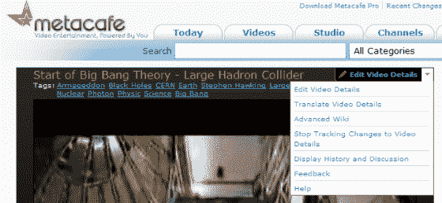
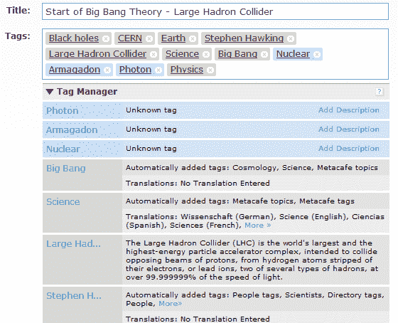

# Metacafe 将其未来押在了 Wikis TechCrunch 的力量上

> 原文：<https://web.archive.org/web/https://techcrunch.com/2008/11/18/metacafe-bets-its-future-on-the-power-of-wikis/>

还记得 [Metacafe](https://web.archive.org/web/20230203163954/http://www.metacafe.com/) 吗？没错，视频娱乐网站 YouTube 的崛起让它黯然失色？现在，它在一个新的产品方向上下了一个大赌注，而且是在零保证的情况下进行的。这场赌博是 [WikiCafe](https://web.archive.org/web/20230203163954/http://wikicafe.metacafe.com/) ，一种视频元数据的协作编辑方法。要理解 WikiCafe 对 Metacafe 的重要性，只需看看该公司官方的研发资源使用情况:60% WikiCafe，30%创收机会，10%其他一切。这说明了一切。

我花了几个小时与该公司的联合创始人兼首席创意官 Eyal Hertzog 进行了交谈，他向我介绍了该公司的新产品愿景，以及该公司在维基方式组织视频方面投入巨资的理由。用户(他也是其中之一)在搜索视频时不能找到“那个”结果，这让 Hertzog 很沮丧。他对“THE”的定义是包含所有相关(最好是准确的)信息，以及多种语言版本、字幕等的单个视频结果。当然，目前的现实是，当我们搜索一个视频时，我们会从多个来源、不同语言、不同浏览量和虚假版本中获得多个结果，有时甚至是数百个。。..你们都知道规矩。

赫佐格解释道:

> “我们实际上认为，高质量的元数据与视频本身一样重要，甚至更重要。我们专注于通过短格式视频提供精彩的娱乐体验，这意味着我们必须让人们每次来到 Metacafe 时都能轻松找到和发现精彩的视频。做到这一点的唯一方法是获得关于我们网站上的视频的准确和完整的信息。我们相信获得这些信息的唯一途径就是寻求我们社区的帮助。WikiCafe 对我们未来的战略绝对至关重要，我们相信它给了我们比其他网站前所未有的竞争优势。”

简而言之，WikiCafe 是你开始喜欢上维基百科的一切，但与视频相协调。它是一个协作视频元数据编辑工具，建立在最初为维基百科编写的维基平台[维基媒体](https://web.archive.org/web/20230203163954/http://www.mediawiki.org/wiki/MediaWiki)之上。它的目的是在一个“文档”上促进标准化的、分类的知识的协作和聚合——在这个例子中是一个视频。

WikiCafe 使用的协作分类法是由社区创建和维护的，所以就像维基百科一样，随着时间的推移，它有可能变得更加全面和准确。当然，另一个主要的好处是社区对数据的编辑进行监管，因此误报和垃圾结果的数量可以大大减少——不是一下子就能减少，但罗马也不是一天建成的。

该系统的核心是一个高级标记系统，支持:

*   重定向:诸如‘PS3’，‘PS iii’，‘PlayStation iii’等标签都被重定向到‘PlayStation 3’。
*   歧义消除:“苹果”作为一个标签会提供“苹果(电脑)”、“苹果(唱片公司)”和“苹果(水果)”等选项。
*   标签层级:标签“iPhone”是“苹果电脑”和“智能手机”的子标签。“苹果电脑”是“技术”的孩子，“智能手机”是“手机”的孩子，“手机”是“通讯设备”的孩子。
*   标签翻译:用一种语言标签标记的视频也会自动用其他语言“标记”,从而提供语言透明的搜索。这意味着使用非日耳曼语言(如希伯来语或日语)的用户将能够以他们的母语字符集搜索“布兰妮·斯皮尔斯”，并获得如同他们使用英语一样的结果。

可编辑的元数据信息包括标题、描述、分级属性(性感、暴力)、语言、相关国家等等。还有元数据模板，如“音乐信息”，其中包括专辑、艺术家、流派和标签。还有“疑似重复”、“误导缩略图”等标志。

当赫佐格给我演示的时候，我们编辑了这个视频的标签，从“TechBrunch”到“TechCrunch ”,并在现有的标签“Michael”和“Arringon”上添加了“迈克尔·阿灵顿”。你可以在这里看到修订历史。

到目前为止，维基咖啡超出了公司的预期。该系统目前每天记录 14，000 次用户编辑操作，高于 9 月份的 4000 次。在我的书中，Metacafe 在这方面也值得称赞，因为形成一个协作社区在许多方面比交付协作技术要困难得多。

ComScore 9 月份的数据将 Metacafe 定位为全球最大的独立视频网站，拥有 3800 万独立用户，仅次于 YouTube 和 MSN(今年夏天超过了 DailyMotion 和 AOL Video)。时间会证明 Metacafe 对 WikiCafe 的赌博是否会有回报，但你不得不佩服这家公司的远见和勇气。它不是坐以待毙，而是挑战极限，向观众传递最准确的视频结果。就我自己而言，我已经开始养成在 YouTube 上试试运气之前搜索 Metacafe 的习惯。
 
