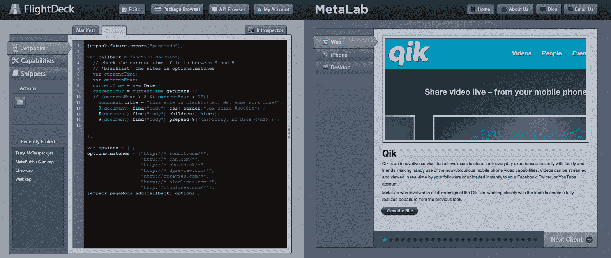

# MetaLab 指责 Mozilla 剽窃其设计(更新)

> 原文：<https://web.archive.org/web/https://techcrunch.com/2010/03/09/metalab-accuses-mozilla-of-plagiarizing-its-design/>

# MetaLab 指责 Mozilla 抄袭其设计(更新)

[MetaLab](https://web.archive.org/web/20221208143248/http://www.metalabdesign.com/)的安德鲁·威尔金森刚刚写了一篇[博文](https://web.archive.org/web/20221208143248/http://blog.metalabdesign.com/post/437932602/metalab-goes-open-source)指责 Mozilla 剽窃其 FlightDeck 编辑器的[设计](https://web.archive.org/web/20221208143248/https://wiki.mozilla.org/File:FlightDeck_Editor.png)。更糟糕的是，威尔金森表示，几个月前，MetaLab 实际上参与了 FlightDeck 的设计竞标，但被 Mozilla 拒绝了。

虽然威尔金森感到不安是可以理解的，但在这一点上，看起来抄袭的图像只是 Mozilla wiki 上的一个模型——而不是实际的产品(尽管它显然仍然很糟糕)。我们联系了 Mozilla 寻求评论。你可以从下面威尔金森的博文中看到一个截图对比。

**更新**:这是 Mozilla 的一个评论，声明复制粘贴设计是一个概念验证:

> Mozilla 现在知道 MetaLab 的一个帖子，显示 Mozilla 开发人员抄袭了以前的设计作品。他们引用的模型是通过剪切和粘贴创建的概念的早期证明，而不是最终的设计。Mozilla 尊重所有设计师的辛勤工作，绝不会抄袭原创内容。Jetpack SDK 的 IDE 的正在进行的设计可在此处[获得](https://web.archive.org/web/20221208143248/http://flightdeck.zalewa.info/)并且在概念验证上的初始签署之后，IDE 的开发完全独立于 MetaLabs 的工作。

在它的 wiki 上，Mozilla 将 FlightDeck 描述为一个工具，使社区能够快速、协作地开发利用 Jetpack 框架的扩展和对 Jetpack 框架核心的扩展至关重要的 Jetpack 功能。

**更新 2** :威尔金森在他的博文中添加了以下更新:

> 我刚和 Mozilla 的团队通过电话，他们道歉并澄清了一些事情。使用我们网站设计元素的设计是一个开发版本，根据他们的说法，在新版本中设计已经改变。也就是说，他们在发布视频和发布产品的博客文章中都使用了这个词。他们告诉我，将博文和视频放在一起的团队在收录时并不知道有相似之处。我们已经要求公开道歉，明天我会做后续报道。

