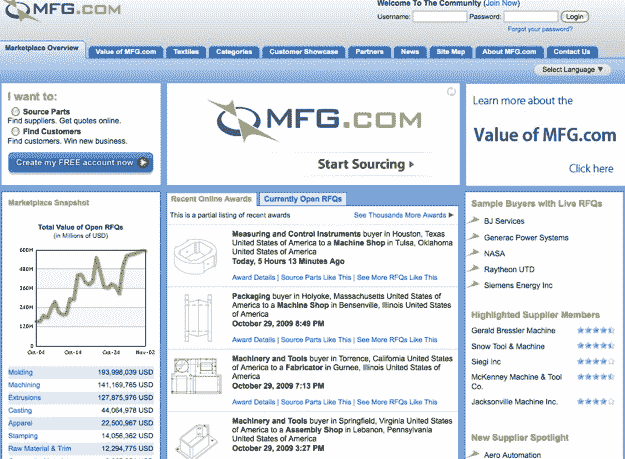
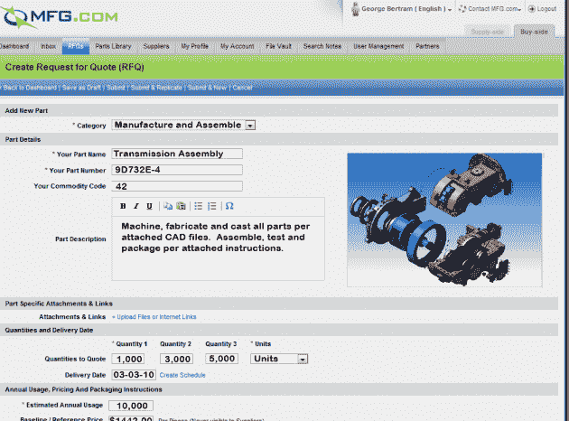

# MFG.com 脱下手铐，重新设计制造业市场 

> 原文：<https://web.archive.org/web/https://techcrunch.com/2009/11/02/mfg-com-takes-off-the-cuffs-with-manufacturing-marketplace-redesign/>

# MFG.com 解除了制造业市场重新设计的束缚

网站的重新设计总是比预期的要长。但是在制造业市场[MFG.com](https://web.archive.org/web/20221209122538/http://www.mfg.com/)的案例中，对其网站的一次大检修花费了三年时间。MFG.com 创始人兼首席执行官米奇·弗里告诉我:“过去三年，整个团队都觉得我们好像被铐上了手铐，无法执行所有伟大的想法。”。

但是现在手铐解开了。昨晚，MFG.com 开放了全新设计的网站。MFG.com 是一个[出奇成功的 B2B 市场](https://web.archive.org/web/20221209122538/http://www.beta.techcrunch.com/2008/01/08/mfgcom-raises-26-million-from-fidelity-ventures-goes-after-alibaba/)，用于采购制造零件，该网站上超过 6 亿美元的未完成报价请求(不到两年前为 5000 万美元)。杰夫·贝索斯和德国山姆威尔兄弟是投资者，富达风险投资也是。

当 Free 在 2000 年推出这个网站时，他是在 ColdFusion 的旧版本上建立的，因为它既快又便宜。考虑到它的成长，这个网站在如此过时的技术上坚持了这么久，真是令人惊讶。直到现在，它才最终拥有了一个基于 Java 的现代架构，并设计成可扩展的。新的架构现在还能够通过 API 支持第三方开发者，公司也可以使用 API 将 MFG.com 集成到他们现有的业务和 ERP 系统中。

网站的大部分变化都发生在后台。MFG.com 最终整合了其 2006 年对 Sourcingparts.com 的收购，这将允许 Free to 在供应商关系营销(SRM)行业推行类似 Salesforce.com 的战略，并将其与他的市场联系起来。他不再以每次 10 万美元的价格向制造商出售 SRM 软件，而是以更低的订阅价格在网上提供相同的软件。

新网站现在还支持多种语言(英语、法语、德语、意大利语、西班牙语、葡萄牙语和中文)和 50 种不同的货币。过去几年，MFG.com 增长最快的市场是中国，它将全球产品公司与中国制造商联系起来。现在有了本地语言和货币，Free 也想进入内部的中文对中文市场。“以前，”Free 说，“MFG.com 的平台只有英语，我们只对那些英语流利并以出口为导向的中国公司有吸引力。我们预计，大量的中国对中国业务将开始在如今几乎不存在的平台上发生。”小心，阿里。

