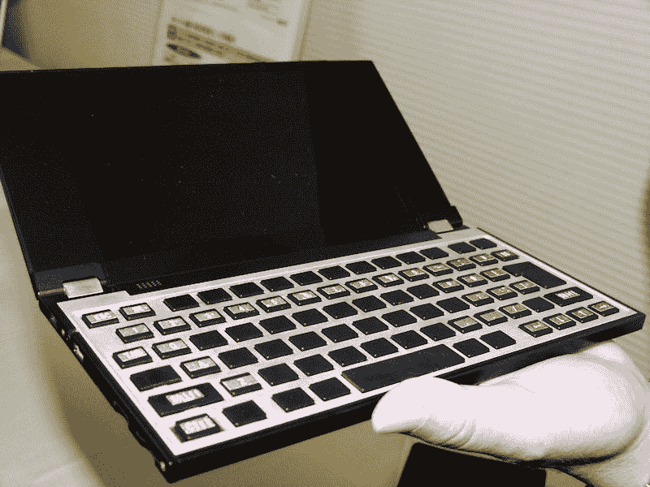
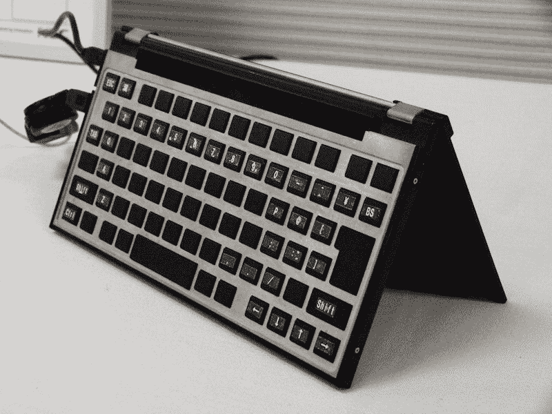
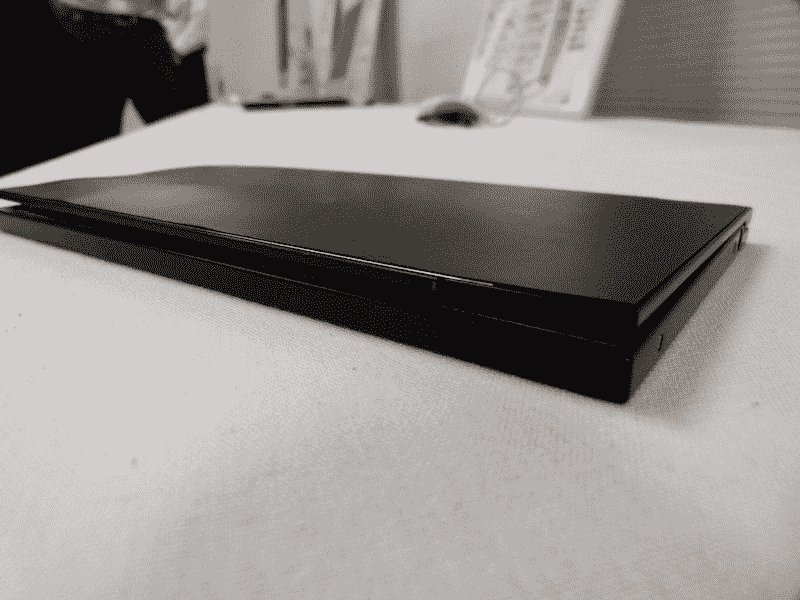

# MGX: NEC 展示 9.9 毫米薄、基于 Android 的笔记本原型机 

> 原文：<https://web.archive.org/web/http://techcrunch.com/2011/10/03/mgx-nec-shows-9-9mm-thin-android-based-notebook-prototype/>

# MGX: NEC 展示 9.9 毫米薄、基于安卓系统的笔记本原型机

NEC 正在开发一款超薄笔记本，搭载[安卓](https://web.archive.org/web/20230203165135/https://techcrunch.com/tag/android)(版本未知)，厚度仅为 9.9 毫米。所谓的 MGX(一个内部代号，“MG”代表“移动设备”)目前只是一个原型，但它看起来非常光滑。

在目前的形式下，该设备长 215 毫米，宽 109 毫米，重 350 克。它采用 7 英寸有机发光二极管触摸显示屏，分辨率为 1024×600，支持 HSUPA 和 Wi-Fi 连接，电池续航时间为 10 小时。

 

据该公司称，MGX 可能在 2013 年左右商业化。

Via [PC 手表](https://web.archive.org/web/20230203165135/http://pc.watch.impress.co.jp/docs/news/20110928_479971.html) [JP]