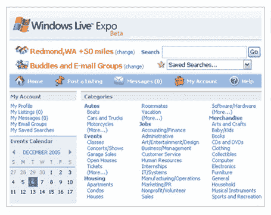

# 微软退出分类列表业务 TechCrunch

> 原文：<https://web.archive.org/web/https://techcrunch.com/2008/06/09/microsoft-exits-classified-listings-business/>

# 微软退出分类列表业务

微软 Live Expo ，他们的分类列表实验[于 2006 年初在](https://web.archive.org/web/20221202111758/http://www.beta.techcrunch.com/2006/01/13/microsoft-expo-beta/)启动，将于 7 月 31 日关闭，网站上贴出的通知说。新的上市已经被暂停。

Craigslist 巩固了其作为顶级免费列表服务的地位。其他服务如 [Kijiji](https://web.archive.org/web/20221202111758/http://www.kijiji.com/) (易贝所有)和 [Oodle](https://web.archive.org/web/20221202111758/http://www.oodle.com/) (最近[与沃尔玛](https://web.archive.org/web/20221202111758/http://www.beta.techcrunch.com/2008/05/30/walmart-launches-classified-listings/)合作)继续增长。最近，Kijiji 对他们令人印象深刻的增长率掀起了波澜。其他分类上市的初创公司继续获得资助。

似乎在分类列表领域没有微软的空间。它加入[死池](https://web.archive.org/web/20221202111758/http://www.beta.techcrunch.com/tag/deadpool)。

下面是它在好日子里的屏幕截图。

