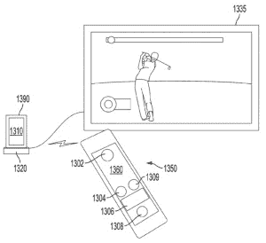

# 微软为双屏瑞士军刀滑盖手机申请更多专利

> 原文：<https://web.archive.org/web/http://techcrunch.com/2011/09/27/microsoft-files-more-patents-for-dual-screen-swiss-army-knife-slider-phone/>

# 微软为双屏瑞士军刀滑盖手机申请更多专利

我可以发誓，我以前就有过这样的梦想，或者至少写过这样的东西，但是看起来微软比我先到专利局。9 月 22 日，微软申请了[“具有多个可互换的第二设备的移动通信设备”](https://web.archive.org/web/20230205080941/http://appft.uspto.gov/netacgi/nph-Parser?Sect1=PTO1&Sect2=HITOFF&d=PG01&p=1&u=%2Fnetahtml%2FPTO%2Fsrchnum.html&r=1&f=G&l=50&s1=%2220110230178%22.PGNR.&OS=DN/20110230178&RS=DN/20110230178)专利，该专利基本上描述了一种滑盖式手机，该手机具有用于更换滑盖键盘的替换组件。

最酷的是，手机应该能够与任何辅助设备进行通信，无论它们是否停靠在手机的小滑出式抽屉中。在图片中，你可以看到一个 QWERTY 键盘，一个 Xperia Play 风格的游戏控制器，一个额外的电池和一个备用屏幕。虽然没有包括在图纸中，但微软也包括了“扩展存储设备、为第一个设备的电池充电或直接为第一个设备供电的太阳能电池板，或医疗传感器(表面温度计等)。)"

该专利继续说，“游戏控制器和键盘可以各自包括一个扬声器和一个麦克风，以实现移动电话手机的操作。第一设备可以同时与多个第二设备中的一个或多个通信

换句话说，微软想让你的手机成为瑞士军刀。这种可能的实现意义深远。游戏控制器是一个显而易见的选择——在手机上放一个支架，你就有了一个漂亮的小型便携式游戏站。随着 Xbox Live 集成到 Windows Phone Mango 中，它肯定是值得的。但是像一块额外的电池(或者可能是太阳能电池板)这样简单的东西，可以在我们使用设备的方式上产生巨大的变化。

诚然，许多手机都允许可互换电池，但没有一款能让你把它们插到滑动底座上。大多数时候，当你在旅途中时，你试图进入后面板，这个过程变得超级乏味。以至于你和我一样，可能会为了避免使用手机而减少使用手机。这项技术有可能使移动世界中的一个更大的问题(电池寿命)变得不那么困难。

 当然，微软和其他公司一直都在申请专利，除非有竞争对手将技术/设计推向市场，否则它们中的许多专利都无人问津。然而，我一直在关注一些最新的微软专利，很明显，这个可拆卸的双屏滑块梦想显然是雷德蒙的一个焦点。我们已经听说了一项专利，该专利改进了滑盖手机的[设计，使键盘和屏幕能够平稳放置。但除此之外，微软](https://web.archive.org/web/20230205080941/https://techcrunch.com/2011/08/12/microsoft-patents-flat-slider-phone-form-factor-multi-touch-gaming-mice/)[还在 7 月份申请了一项专利*](https://web.archive.org/web/20230205080941/https://techcrunch.com/2011/07/11/microsoft-patent-describes-detachable-dual-screen-device/) ，再次*描述了一种带有可拆卸第二屏幕的手机，其中两个组件可以相互通信，无论拆卸与否。事实上，在那项专利和这份最新的专利中，有些相同的图纸是重复的(如右图所示)。*

 *这显然不能证明什么，但这无疑是一个迹象，表明微软对这个想法进行了长时间的深思熟虑。

[via [Joystiq](https://web.archive.org/web/20230205080941/http://www.joystiq.com/2011/09/26/microsoft-patents-modular-phone-with-controller-attachments/)*