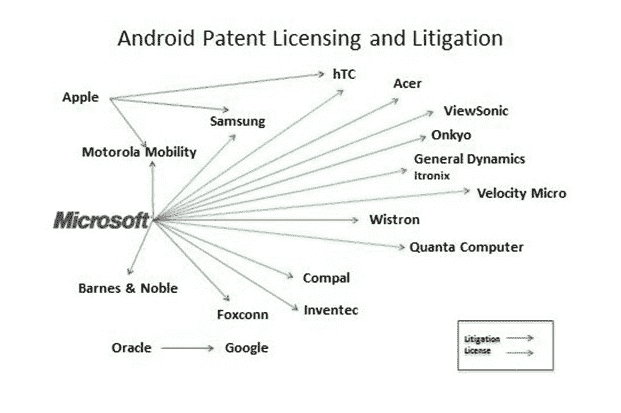
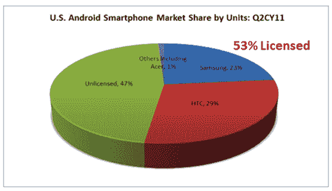

# 微软与仁宝电子签署第十项 Android 专利协议 TechCrunch

> 原文：<https://web.archive.org/web/http://techcrunch.com/2011/10/23/microsoft-inks-android-patent-deal-with-compal-electronics/>

# 微软与仁宝电子签署第十项安卓专利协议

微软已经签署了另一份安卓专利协议，这次是和中国的 T2 仁宝电子公司。目前微软的专利协议名单包括[三星](https://web.archive.org/web/20230203184732/https://techcrunch.com/2011/09/28/samsung-and-microsoft-ink-deal-for-cross-licensing-patents-marketing-windows-phone/)、 [HTC、](https://web.archive.org/web/20230203184732/https://techcrunch.com/2010/04/28/microsoft-htc-android-apple-patents/)纬创、[广达](https://web.archive.org/web/20230203184732/https://techcrunch.com/2011/10/13/microsoft-inks-another-android-patent-deal-this-time-with-quanta/)、宏碁和通用动力 Itronix。这是与微软 Android 专利相关的第十份协议，也是过去四个月中的第九份协议。

根据新闻稿，专利协议涵盖任何运行 Android 或 Chrome OS 平台的平板电脑、手机、电子阅读器和其他以消费者为中心的设备。与广达的交易类似，仁宝电子将为运行 Android 或 Chrome 操作系统的手机、平板电脑或电子阅读器支付版税。与许多此类交易一样，特许权使用费的确切结构不得而知。

在一篇博客文章中，微软透露，为第三方生产智能手机和平板电脑的仁宝公司年收入约为 280 亿美元。

来自新闻稿:*“我们很高兴与原始设计制造(ODM)行业的领导者之一 Compal 达成这项协议。微软公司副总裁兼知识产权集团副总法律顾问 Horacio Gutierrez 表示:“加上过去几个月与纬创资通(Wistron)和广达电脑(Quanta Computer)签署的许可协议，今天与仁宝(Compal)签署的协议意味着，全球超过一半的 Android 和 Chrome 设备 ODM 行业现在都获得了微软专利组合的许可。“我们为我们的许可计划在解决围绕 Android 和 Chrome 的知识产权问题方面的持续成功感到自豪。”*

微软继续从 Android 中获利，这项交易只是在谷歌对微软做法的看法上火上浇油。谷歌认为微软试图从安卓系统中获利是一种敲诈勒索，并削弱了谷歌对安卓系统是一个 T2 免费平台的信念。当然，微软首席执行官史蒂夫·鲍尔默[显然不同意这个](https://web.archive.org/web/20230203184732/https://techcrunch.com/2010/10/03/android-isnt-free/)。

但微软反驳说，其协议减少了专利诉讼的数量，如下图所示。来自布拉德·史密斯(Brad Smith)和古铁雷斯(Smith 是微软的执行副总裁兼总法律顾问)今天写道，*作为协议确保对微软的发明和专利组合的尊重和合理补偿。同样重要的是，它们使被许可方能够在长期稳定的基础上利用我们的专利创新……虽然诉讼可能会占据许多头条新闻，但它们正在被签署的许可协议数量所取代。在这一点上，快速的许可正在重塑智能手机专利的法律格局。*

该公司补充说，在三星授权协议之后，微软现在与占美国所有安卓智能手机 53%的原始设备制造商签订了授权协议。声明中还包括对谷歌的抨击:*对于那些继续抗议智能手机专利丛林太难驾驭的人来说，是时候醒醒了。*

