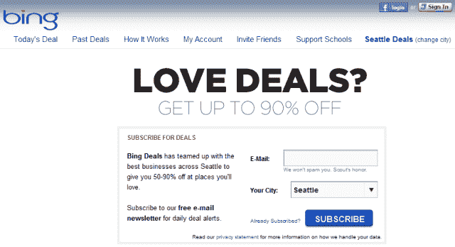
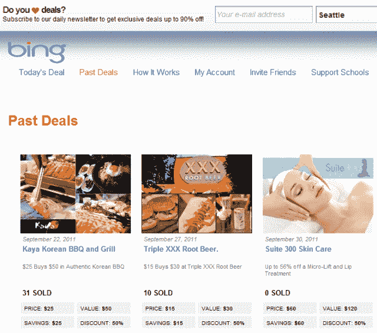
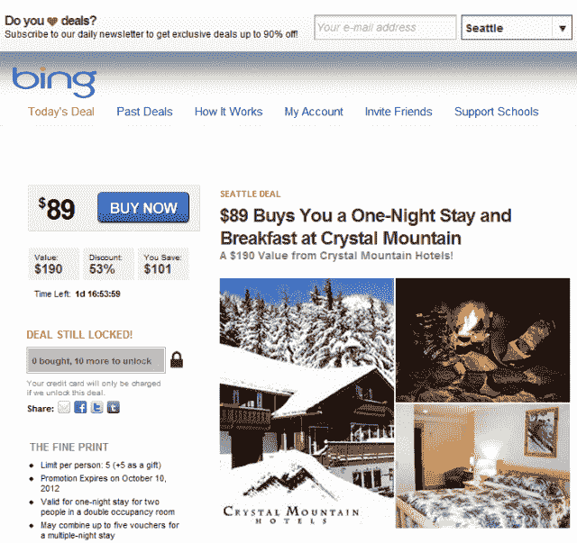
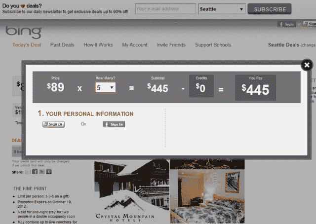
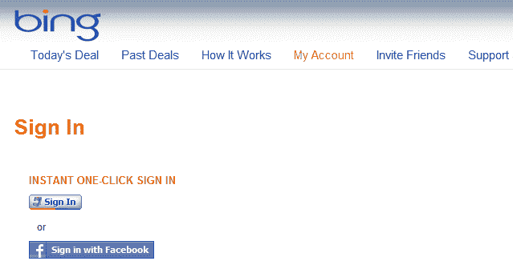
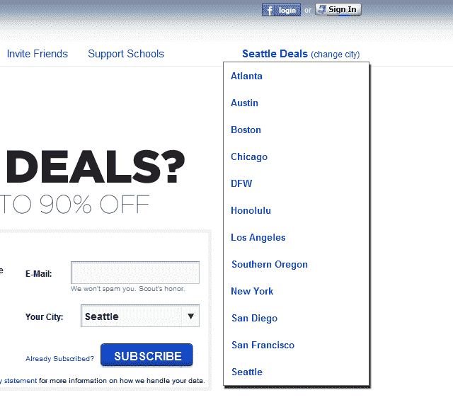

# 微软对每日交易越来越认真了 

> 原文：<https://web.archive.org/web/http://techcrunch.com/2011/10/10/microsoft-is-getting-more-serious-about-daily-bing-deals/>

一位消息灵通人士告诉我，微软似乎正在准备正式推出一个由[白标团购平台](https://web.archive.org/web/20230203074142/http://www.poweredbytippr.com/)服务提供商 [Tippr](https://web.archive.org/web/20230203074142/http://www.crunchbase.com/company/tippr) 支持的[必应](https://web.archive.org/web/20230203074142/http://www.crunchbase.com/product/bing)品牌的每日交易网站。你不必相信我的话:微软和 Tippr 正在测试这项服务，Bing 独家的 daily deals 网站隐藏在众目睽睽之下(见[这里](https://web.archive.org/web/20230203074142/http://bing.tippr.com/)和[这里](https://web.archive.org/web/20230203074142/https://ssl.bing.com/daily-deals/)，或者查看下面的截图)。

需要说明的是，这项服务明显不同于微软早先推出的 Bing Deals(Bing Deals )( Bing Deals )( Bing Deals )( Bing Deals )( Bing Deals )( Bing Deals )( Bing Deals )( Bing Deals )( Bing Deals )( Bing Deals )( Bing Deals )( Bing Deals )( Bing Deals )( Bing )( Bing Deals)的(T12 )( T13 ), Bing Deals ), Bing Deals(Bing Deals )( Bing Deals )( Bing Deals )( Bing Deals )( Bing Deals)的

我没有发现任何关于 Tippr 支持的 Bing 独家每日交易网站的官方视频或截图的提及、链接。如果我错了，请纠正我，但是我很确定微软从来没有发布过任何关于 Bing.com/daily-deals T21 网站的公告。

从下面的截图可以看出，如果你曾经访问过 Groupon 和 LivingSocial 等团购网站，你会对 Bing 的团购网站很熟悉。

您可以使用您的脸书帐户或 Windows Live ID 登录，浏览并分享[当前交易](https://web.archive.org/web/20230203074142/https://bing.tippr.com/offer/)、[过去交易](https://web.archive.org/web/20230203074142/https://bing.tippr.com/seattle/past-deals/)，并了解更多关于[如何运作的信息](https://web.archive.org/web/20230203074142/https://bing.tippr.com/pages/how-it-works/)。后一页指出:

> 订阅 Bing Deals，我们将每天通过电子邮件向您发送当地一家大公司的新交易。你也可以在 Bing.com 搜索或者在 Bing.com/daily-deals.浏览交易

再说一次，这个网站是我在网上能找到的唯一一个提到过 Bing.com/daily-deals 网址的网站。

该网站还提到了一种叫做“甜蜜交易”的东西，描述如下:

> 什么是优惠交易？这是一笔越来越好的交易。随着更多的交易被购买，出现在 Bing Deals 上的一些交易将获得更好的价值。
> 
> 例如，在某个街角的面包店，一笔交易可能以 20 美元买 10 美元开始。如果有足够多的人购买优惠券，交易就达到了甜头，25 美元就变成了 10 美元！无论如何，你将总是为你购买的交易支付相同的金额，但是你辛苦赚来的钱会增加！
> 
> Sweeten Deals 的酷之处在于，随着越来越多的人购买，交易的价值对每个已经购买和将要购买交易的人来说都会变得更好。这就是为什么与你的朋友分享你买的东西是一个好主意，这样你和其他人都能得到最大的回报。

从下面的一个截图中可以看出，daily deals 已经/即将在 12 个市场推出，包括亚特兰大、波士顿、芝加哥、旧金山、纽约、洛杉矶和西雅图。

当联系到 Tippr 首席执行官[马丁·托拜厄斯](https://web.archive.org/web/20230203074142/http://www.crunchbase.com/person/martin-tobias)时，他拒绝对微软和 Tippr 之间的合作关系发表评论。微软的一位发言人告诉我，他认为这是他们之前谈论的一些事情的一部分，然后被称为 Bing 在一些城市的独家交易，这些交易只能通过 Bing 获得，但团队仍在“启动和运行并解决问题”。

同样值得注意的是，微软上周扩大了其 Bing 商业门户网站，增加了本地企业在 Bing 上进行团体交易(而不是常规交易)的能力(以及其他功能)。

搜索引擎之地为所有新事物提供了一个极好的展示平台。

美国的其他日常交易网站包括 Groupon、LivingSocial、Google Offers、BuyWithMe、AmazonLocal、HomeRun 和 Dealster 等。

