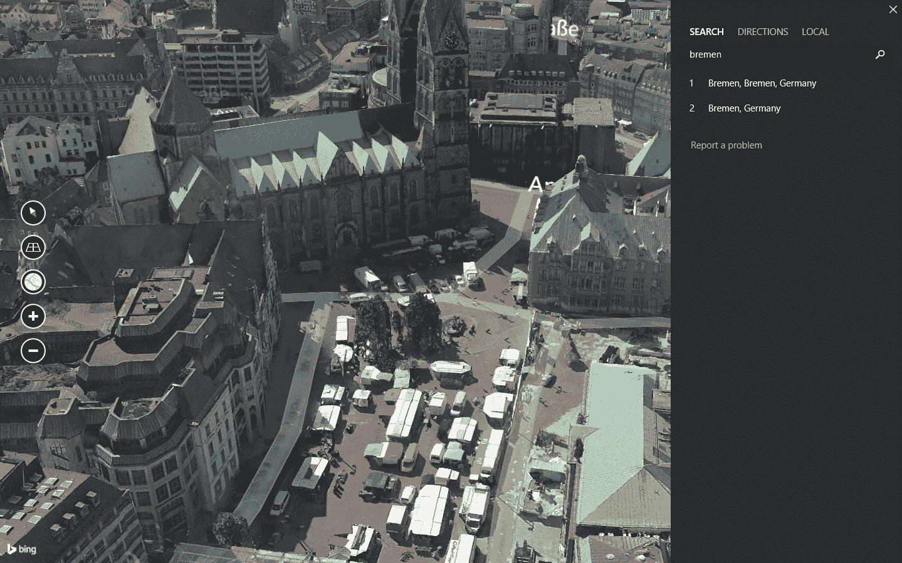
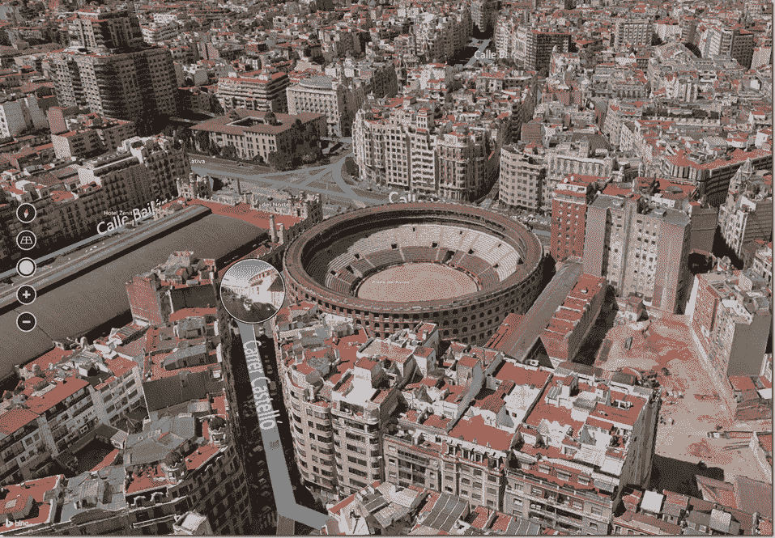

# 微软推出带有高分辨率 3D 图像的必应地图预览版 

> 原文：<https://web.archive.org/web/https://techcrunch.com/2013/12/05/microsoft-launches-bing-maps-preview-with-high-res-3d-imagery/>

正如微软在今年早些时候的 BUILD 开发者大会上向 承诺的那样，该公司今天[发布了其 Windows 8.1 新地图应用的首个预览版](https://web.archive.org/web/20221207062914/http://www.bing.com/blogs/site_blogs/b/search/archive/2013/12/05/maps3d.aspx)。此次发布的亮点是添加了 3D 图像，这是微软几年前在 Bing 地图在线上进行的尝试，但在放弃其专有的 Silverlight 技术后被搁置。新应用程序现已在 [Windows 商店](https://web.archive.org/web/20221207062914/http://apps.microsoft.com/windows/en-us/app/bing-maps-preview/75ce2a6a-8a25-4916-83d0-19b8e7b60787)中提供。

微软表示，为了创建这些 3D 图像，迄今为止，它处理了超过 121 万亿像素来构建这个 3D 环境。它显示了。这些图像非常清晰和详细，第一眼看上去，感觉它很容易与谷歌竞争，并且经常胜过谷歌的努力，特别是当涉及到树木和汽车和亭子等较小的物体时。

微软总共制作了 70 个城市的 3D 地图。这些城市从澳大利亚的堪培拉到德国的不来梅和缅因州的波特兰。然而，缺少的是世界上大多数较大的城市。到目前为止，这里还没有纽约、旧金山、悉尼、柏林或伦敦，但微软可能会在发布该应用程序的最终版本之前添加许多这样的城市。

正如微软目前倾向于做的那样，该应用程序主要针对触摸进行了优化。它与鼠标配合使用非常好，但如果你想真正享受它，你需要一台 Windows 平板电脑或支持触摸的笔记本电脑，因为通过左右拖动按钮来倾斜和旋转鼠标感觉不太自然。

该应用程序还使微软版本的街景(Streetside)可供那些想从地面近距离观看街道的人使用。多年来，微软试验了这个工具的不同版本。它现在基本上是街景的克隆，尽管它有一个很好的功能:你可以选择在屏幕底部看到一个大地图，这比谷歌在街景图像角落使用的小地图更容易导航。

正如预期的那样，该应用程序还具有常见的搜索功能、交通信息和其他功能。它与 Open Table 集成在一起，如果这还不够，您还可以通过点击电话号码开始 Skype 通话。

