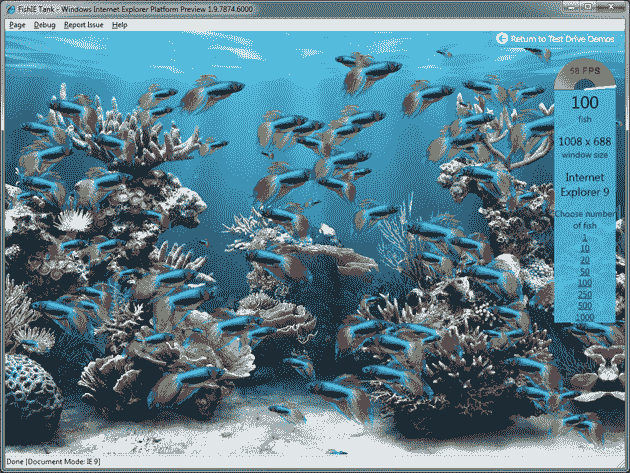

# 微软发布 IE9 平台预览版 3:画布、音频/视频标签等 

> 原文：<https://web.archive.org/web/https://techcrunch.com/2010/06/23/microsoft-launches-ie9-platform-preview-3-canvas-audiovideo-tags-and-more/>

# 微软发布 IE9 平台预览版 3:画布、音频/视频标签等

今天在旧金山，微软的 IE 团队发布了 Internet Explorer 平台预览版 3，这是开发者预览版的最新版本，包括许多主要的新功能。平台预览版最大的增加是对 HTML 画布、音频/视频标签的支持，以及主要集中在 IE9 硬件加速上的性能提升。在一系列展示新功能的演示中，IE 团队成员让我们体验了当他们利用计算机的多核和 GPU 时，浏览器中的高级操作有多流畅(历史上大多数浏览器只利用你的 CPU，而不利用第二个内核)。

微软利用其[试驾](https://web.archive.org/web/20221006202624/http://ie.microsoft.com/testdrive/)网站上的各种演示来展示浏览器在这些新功能上的能力(他们指出，该网站自推出以来已被浏览了 1600 万次)。演示现在面向所有人直播——一定要试试微软的土豆枪先生——这是指谷歌发布的展示 Chrome 渲染速度的[精彩视频](https://web.archive.org/web/20221006202624/https://beta.techcrunch.com/2010/05/04/google-chrome-video/)，后来被 Opera[恶搞](https://web.archive.org/web/20221006202624/http://www.youtube.com/watch?v=zaT7thTxyq8&feature=player_embedded)。更有趣的是，微软还在活动中分发了一些土豆头先生玩具供媒体使用(如下图)。

今天给出的演示显示平台预览版听起来击败了 Firefox 和 Chrome，但值得指出的是，这不一定是苹果之间的比较，因为用户还不能真正使用 IE9 预览版。同样，IE9 的博客之前给出了 IE9 上的硬件加速[与苹果最近发布的 Safari 5 的对比，在 Safari 5 上，IE9 明显更快(但尚未上市)。微软在 3 月份开始发布这些平台预览，以此来帮助增加与开发者社区的交流，并展示 IE 即将推出的一些功能。微软尚未宣布 IE9 测试版何时可供下载。](https://web.archive.org/web/20221006202624/https://beta.techcrunch.com/2010/06/08/ie9-safari-5/)

这里有一些试驾演示的截图，显示了 Chrome 5 在 Mac 上运行与 IE9 平台预览的得分:

