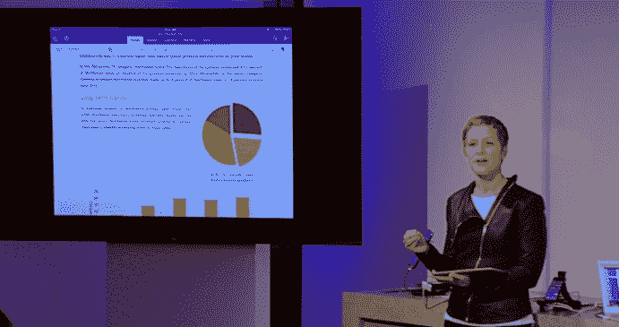

# 微软发布 iPad 版 Office，太平洋时间今天上午 11 点 

> 原文：<https://web.archive.org/web/https://techcrunch.com/2014/03/27/microsoft-launches-office-for-ipad-available-at-11am-pt-today/>

# 微软发布 iPad 版 Office，太平洋时间今天上午 11 点

今天，在旧金山的新闻发布会上，微软发布了苹果 iPad 版 Office。这个消息虽然在意料之中，但很重要:微软支持苹果的平板电脑标志着该公司及其平台战略的一个重要时刻。

代码将于今天上午 11 点在 iOS 应用商店上线。具体来说，Word、Excel 和 PowerPoint 将在苹果的移动平台上提供。

这些应用程序建立在 OneDrive 之上，因为它们支持云存储，并将允许多个用户之间的实时协作。微软列举了最多五个，但不清楚 Word 中到底有多少限制。

如果你有一个 [Office 365 订阅](https://web.archive.org/web/20221005235624/http://office.microsoft.com/en-us/products/compare-microsoft-office-products-FX104165233.aspx?WT%2Eintid1=ODC_ENUS_FX101785584_XT104052692&WT%2Eintid2=ODC_ENUS_FX101785584_XT104187042)，你可以编辑，但如果你没有，你仍然可以下载和查看。Office 365 个人套餐[每月起价 6.99 美元，家庭高级版起价 9.99 美元，允许用户在最多五台 PC 或 MAC 电脑上安装 Office。](https://web.archive.org/web/20221005235624/http://blogs.office.com/2014/03/13/announcing-office-365-personal-a-new-way-to-access-office-365/)

*顶级图片来源:[丹·泰勒/海森堡媒体](https://web.archive.org/web/20221005235624/http://www.heisenbergmedia.com/)*