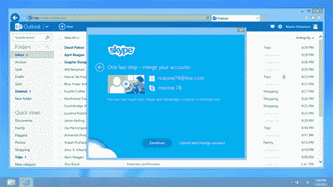

# 微软为 Outlook.com 推出 Skype 预览版 TechCrunch

> 原文：<https://web.archive.org/web/https://techcrunch.com/2013/04/29/microsoft-launches-preview-of-skype-for-outlook-com/>

# 微软为 Outlook.com 推出 Skype 预览版

微软[宣布](https://web.archive.org/web/20221005145410/http://blogs.office.com/b/microsoft-outlook/archive/2013/04/29/skype-comes-to-outlook-com.aspx)将从英国开始为 Outlook.com 推出 Skype 预览版。这项服务将在未来几周内在美国和德国推出，然后推广到世界其他地区。

随着 Skype for Web 的推出，VoIP 服务加入了微软的在线工具套件，包括 [SkyDrive](https://web.archive.org/web/20221005145410/https://beta.techcrunch.com/2013/02/08/edit-away-no-sign-in-needed-with-microsoft-skydrive-and-office-web-apps/) 。自六个月前在[推出以来，意在取代 Hotmail 品牌和设计的 Outlook.com 已经获得了 6000 万用户。2011 年 10 月，微软以 85 亿美元收购了 Skype。](https://web.archive.org/web/20221005145410/https://beta.techcrunch.com/2013/02/18/microsoft-takes-outlook-com-out-of-preview/)

Skype for Outlook.com 需要一次性下载插件，该插件可用于最新版本的 Internet Explorer、Chrome 和 Firefox。用户可以使用他们的 Microsoft 帐户连接到 Outlook.com。已经拥有 Skype 帐户的人可以将其与 Outlook.com 联系起来，这样他们就可以将自己的 Skype 联系人添加到电子邮件服务中。

有关首次展示和逐步说明的更多详细信息，请访问 [Outlook 博客](https://web.archive.org/web/20221005145410/http://blogs.office.com/b/microsoft-outlook/archive/2013/04/29/skype-comes-to-outlook-com.aspx)和 [Skype 博客](https://web.archive.org/web/20221005145410/http://blogs.skype.com/2013/04/29/type-less-talk-more-make-skype-calls-directly-from-your-outlook-com-inbox/#fbid=WY1GLg1deDg)。