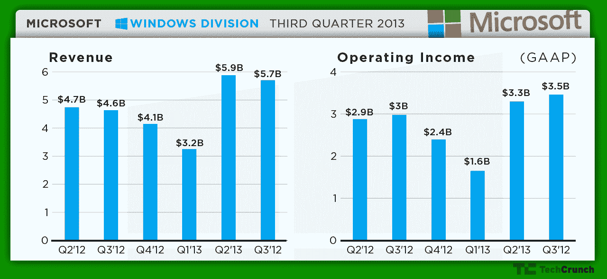

# 微软 2013 年第三季度业绩超出预期，每股收益 0.72 美元，收入 204.9 亿美元，首席财务官 Peter Klein 离开 

> 原文：<https://web.archive.org/web/https://techcrunch.com/2013/04/18/microsoft-msft-earnings-q3-2013/>

# 微软 2013 年第三季度业绩超出预期，每股收益 0.72 美元，收入 204.9 亿美元，首席财务官彼得·克莱因离职

微软刚刚公布了 2013 年第三财季的业绩。该公司的收入略低于预期，为 204.9 亿美元，但每股收益为 0.72 美元，超过了预期。尽管 Windows 8 和 PC 销售继续令人失望，但分析师一致认为，与去年相比，微软的收入将增长 13%。[人们的预期是](https://web.archive.org/web/20221205125016/http://finance.yahoo.com/q/ae?s=MSFT+Analyst+Estimates)微软本季度将报告收入 205.6 亿美元，每股收益 0.68 美元，而 2012 年第三季度微软报告的收入为每股收益 0.60 美元，每股收益 174.1 亿美元。 

微软首席执行官史蒂夫·鲍尔默(Steve Ballmer)在声明中表示:“随着越来越多的人选择包括 Office 365、Windows Azure、Xbox LIVE 和 Skype 在内的微软服务，我们在云服务上的大胆押注正在取得回报。”。“虽然仍有工作要做，但我们乐观地认为，我们在 Windows 设备上的押注让我们长期处于有利地位。”

传统上非常强劲的上个季度，该公司[报告](https://web.archive.org/web/20221205125016/https://beta.techcrunch.com/2013/01/24/microsoft-q2-2013/)创纪录的 GAAP 收入 215 亿美元，净收入 63.8 亿美元，每股摊薄收益 0.76 美元。

作为今天公告的一部分，微软还表示，其首席财务官彼得·克莱恩将在担任该职位约四年并在公司工作 11 年后离开公司。微软将在未来几周内从其财务领导团队中宣布一位新的首席财务官。

鉴于最近 Windows 8 的发布和 PC 市场的低迷，Windows 部门的业绩这一次肯定会受到大量审查。上个季度，微软报告该集团的收入同比增长 24%(总计 58.8 亿美元)。这一次，Windows 部门公布的收入为 57 亿美元，同比增长 23%。

以下是该公司各个部门本季度的业绩:

*   微软商业部门公布了 63.2 亿美元的收入，比去年增长了 8%
*   服务器和工具业务报告收入 50.4 亿美元，比去年增长 11%
*   在线服务部门报告收入为 8.32 亿美元，比去年增长 18%
*   娱乐和设备部门公布收入为 25.3 亿美元，比去年增长 56%

上个季度，服务器和工具部门的收入增长了 9%，达到 51.9 亿美元。另一方面，商业部门报告下降了 10%，而在线服务部门和娱乐和设备部门(Xbox 的总部)报告增长了 11%。