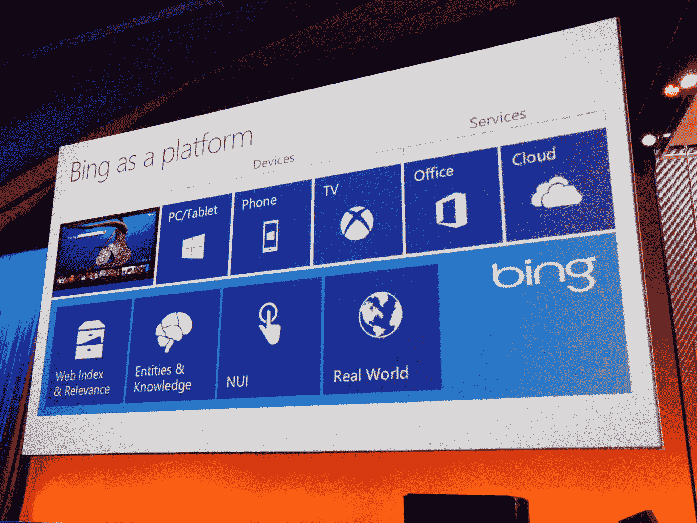

# 微软开放 Bing 作为开发者平台 

> 原文：<https://web.archive.org/web/https://techcrunch.com/2013/06/26/microsoft-opens-up-bing-as-a-platform-for-developers/>

在今天的 [Build](https://web.archive.org/web/20230216203939/http://www.buildwindows.com/) 开发者大会上，微软[宣布](https://web.archive.org/web/20230216203939/http://www.bing.com/blogs/site_blogs/b/search/archive/2013/06/26/bingbuild.aspx)将向开发者开放相当一部分[必应](https://web.archive.org/web/20230216203939/http://bing.com/)的高级功能。正如微软公司副总裁 Gurdeep Singh Pall 所指出的，开发人员已经在使用 Bing APIs，但应用程序现在可以使用 Bing 的实体和知识、自然用户界面、[光学字符识别](https://web.archive.org/web/20230216203939/http://www.bing.com/dev/en-us/ocr)和新的[地图和可视化功能](https://web.archive.org/web/20230216203939/http://visualstudiogallery.msdn.microsoft.com/bb764f67-6b2c-4e14-b2d3-17477ae1eaca)，包括微软刚刚宣布的地图三维图像。

正如 Singh Pall 所指出的，微软已经私下使用了所有这些功能，但是他认为“如果我们可以用一个好的 API 做一些事情，第三方也可以做一些有爆炸性的事情。”

他说，必应“不仅仅是一个伟大的搜索引擎，而且这个团队已经建立了一些强大的功能。”毕竟，Bing 非常擅长理解用户意图、网络上的非结构化内容以及其他查询和数据类型，这对于开发人员来说并不容易实现。

他说，这个团队一直相信必应可以做很多“在搜索框之外实际上非常有价值”的事情。很长一段时间以来，我们认为你可以利用这些能力创造一些很棒的体验。”

开发者将获得 Bing 的大部分数据，包括其网页索引和相关性引擎，以及其知识库和对实体的理解。Bing 团队还致力于许多自然用户界面技术，包括语音识别，开发者也可以将这些技术添加到他们的应用程序中。

以下是面向开发人员的新功能的完整列表:

> **将世界知识融入您的应用**
> 
> *   **了解世界:**我们认为知识不仅仅是一张“图表”。它需要将网络的深层信息与从理解现实世界中的人、地方、事物和行为中获得的洞察力结合起来。**Bing 实体 API** 允许开发人员使用这种理解创建应用程序，以构建增强用户能力的场景，从而比现在更快、更容易地发现他们的世界并与之互动。
> 
>  ****自然直观的用户体验**
> 
> *   **视觉的礼物:**赋予机器看和理解的能力是一个长久以来的科幻梦。 **Bing 光学字符识别** (OCR) **控件**使开发人员能够将微软强大的基于云的视觉识别功能集成到他们的应用程序中。
> *   **一次编写，随处阅读:**世界正在缩小，信息日益全球化。Bing Translator Control**可以让应用程序检测文本，并自动将文本翻译成指定的语言，这样无论用户身在何处，使用何种语言，他们都可以随时了解信息。**
> ***   **声音的力量:**能够自然地与你的设备对话来做某事是用户的最高要求。用于 Windows 8.1 的 Bing 语音控制允许开发者让用户仅仅使用他们的声音就能与他们的应用程序互动。此外，用于 Windows 8.1 的 **Bing 文本到语音转换 API**允许设备和应用大声说话，使用户交互更加自然和直观。**
> 
>  ******对物质世界的认识********

 *****   我们生活中所做的很多事情都取决于我们身在何处以及我们周围的事物。**Bing Maps SDK for Windows 8.1**为 Windows 8.1 中的 Windows Store 应用提供地图、路由和流量功能。
***   **身临其境的地理空间体验:**有时你需要的不仅仅是方向。用于 Windows 8.1 的 **Bing Maps 3D SDK 的预览版**将提供照片般逼真和流畅的地图体验，让开发人员能够构建以用户为中心的应用程序。******