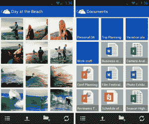
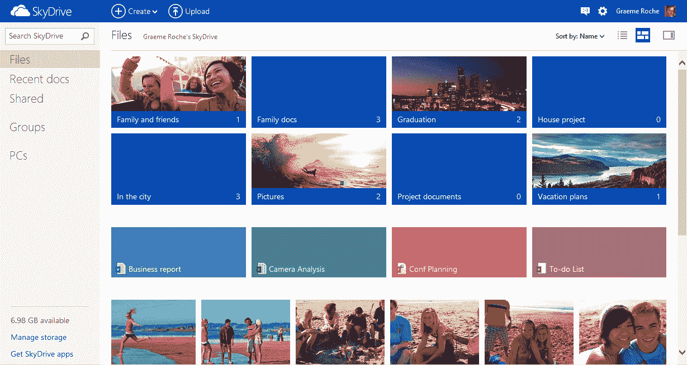

# 微软的 Outlook.com 现在有 1000 万用户，SkyDrive 有了新的用户界面和安卓应用 

> 原文：<https://web.archive.org/web/https://techcrunch.com/2012/08/14/microsoft-outlook-com-now-has-10-million-users-skydrive-gets-a-new-ui-android-app/>

# 微软的 Outlook.com 现在有 1000 万用户，SkyDrive 有了新的用户界面&安卓应用

微软刚刚宣布，Hotmail 广受欢迎的更新版本 Outlook.com T2 已经拥有 1000 万用户。重新设计的 Outlook.com 用户界面现在也开始出现在微软的其他产品中，今天，微软的在线存储服务 SkyDrive.com[正在进行一次重大的设计革新。新设计采用了与 Outlook.com 相同的 Metro/Windows 8 外观，采用了大字体、磁贴和其他新的设计元素。](https://web.archive.org/web/20221204095639/http://skydrive.com/)

微软表示，它已经更新了“几乎 100%的 SkyDrive UI”，但除了新的外观，该服务现在还提供了许多新功能，包括即时搜索(也可以在 Office 文档中找到内容)和上下文工具栏，这应该可以使找到常见的操作和命令变得更容易。新的 UI 还具有更好的排序选项，并支持多选和拖放。

喜欢旧 SkyDrive 的更传统的文件管理器外观的用户也可以将默认模式切换回旧的详细信息视图。此更新将在未来 24 小时内推出。

[YouTube http://www.youtube.com/watch?v=DaWw0zLT67E]

 适用于 Windows 和 OS X 的 SkyDrive 应用程序今天也获得了重大更新。例如，照片上传现在应该明显更快了，该应用程序现在使用更少的 CPU 资源来寻找文件中的变化，然后再开始新的同步。这一更新将在本周内逐步推出。

在过去几个月发布了适用于 SkyDrive 的 iPhone 和 Windows Phone 应用程序之后，微软今天还宣布，它正在开发一款 Android 应用程序，该程序将在未来几周内推出。该应用程序将与微软的其他 SkyDrive 移动应用程序非常相似，并将允许用户浏览、保存和上传文件。此外，微软表示，“你还可以从其他应用程序打开 SkyDrive 文件，以及从其他应用程序上传、保存和共享到 SkyDrive。”

## 面向开发人员的 SkyDrive

对于开发者来说，SkyDrive 团队今天宣布，它已经取消了对第三方应用程序可以上传到 SkyDrive 的文件类型的任何限制。此外，SkyDrive API 现在包括一个用于打开和保存文件的[文件选择器](https://web.archive.org/web/20221204095639/http://isdk.dev.live.com/ISDK.aspx?category=scenarioGroup_skyDrive&index=0)，开发者现在可以上传全分辨率的图像。

