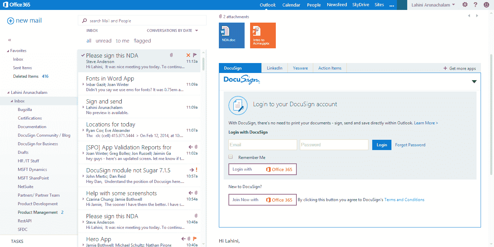

# 微软与 DocuSign 合作，将电子签名引入 Office 365 

> 原文：<https://web.archive.org/web/https://techcrunch.com/2014/02/17/microsoft-partners-with-docusign-to-bring-esignatures-to-office-365/>

# 微软与 DocuSign 合作，将电子签名引入 Office 365

微软和电子签名服务 [DocuSign](https://web.archive.org/web/20221205134409/http://www.docusign.com/) 今天宣布了一项长期合作伙伴关系，这将使 Office 365 用户无需离开微软的 Office 应用程序就可以轻松提交和签署文档。

两家公司宣布，这种新的解决方案将于下月初在 [Office 商店](https://web.archive.org/web/20221205134409/http://office.microsoft.com/en-us/store/store-FX102759646.aspx)出售，它是建立在微软 Office 平台之上的。[该应用](https://web.archive.org/web/20221205134409/http://www.docusign.com/microsoftapps)将集成到 Outlook、Word、SharePoint Online 和 SharePoint Server 2013 中。这意味着 Office 365 和 SharePoint admins 将能够为他们的所有用户远程添加服务，该工具也将与 Azure Active Directory 集成，因此无需单独登录即可从微软的应用程序中使用 DocuSign。

所有文档都将存储在 OneDrive for Business(以前的 SkyDrive)上。

总的来说，这是一个非常简单的集成，但它确实让严重依赖 DocuSign 的公司更容易选择 Office。对于微软来说，这也是一个谈论围绕其 Office 套件的应用生态系统的机会。

“像 DocuSign 这样的领先合作伙伴正在 Office 平台上开发应用程序，以帮助我们的客户直接从他们最常用的应用程序中获得更多价值，”微软 Office 营销副总裁约翰·凯斯在今天的公告中说。

