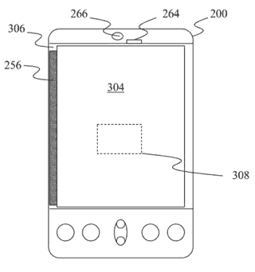
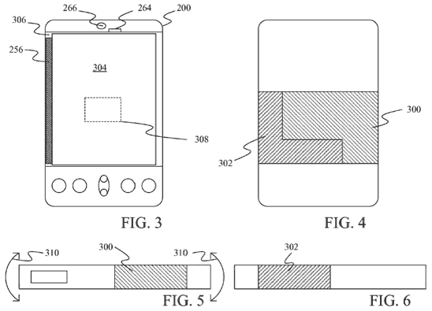

# 微软专利操纵 3D 虚拟物体，投掷手势

> 原文：<https://web.archive.org/web/http://techcrunch.com/2011/10/27/microsoft-patents-manipulation-of-3d-virtual-objects-throwing-gestures/>

又一批微软专利申请进入了公众视野，这些申请可能比上一批更酷。他们描述了“投掷手势”，与 3D 虚拟对象的交互，甚至将其向后推一点，以描述一种新的电子邮件视图格式。

我们来看看，好吗？

早在 2010 年 4 月申请，这项专利申请概述了一些与我们在[微软描绘他们的未来版本](https://web.archive.org/web/20230320143125/https://techcrunch.com/2011/10/27/microsofts-vision-of-the-future-includes-touch-sensitive-everything-and-beautiful-people-only/)的视频中看到的一些技术惊人地相似的东西。它描述了用户在 2D 表面上的输入，然后将其模拟为与虚拟 3D 对象的直接接触。所述虚拟 3D 对象旨在基于用户的物理输入来移动或被操纵。

在今天早上的视频中，用户可以在不接触设备的情况下输入手势，正如旅行中的女商人在空气中画出一颗心，然后被翻译到屏幕上，并传回她的厨房墙壁。也许这项专利是我们现在拥有的和微软设想的未来之间的桥梁，但不管怎样，我希望这项专利成为现实。

 我们名单上的下一个专利申请是最近提交的——今年 7 月——基本上是为了让我们更容易打开手持计算设备。因为按按钮太费力了。这项专利概述了一种给设备供电的方法，无论是手机还是平板电脑(或者任何你可以拿着的计算设备)，都可以通过纵向拿着所述设备。

该专利讨论了该功能必须满足的某些规格，如设备必须保持的角度，或者设备在通电前必须保持的时间。我们也很高兴看到这一点，因为平板电脑每次处于纵向时都要开机，这实在是太烦人了。该专利还涵盖了一种可以执行这种神奇的肖像启动操作的设备，以及这样做的方法。微软，你真会掩饰。

这份 2010 年 4 月的专利申请有点老套，或者至少与充满了崇高的未来预测和 T2 谦虚的未来预测的一天相比，感觉是这样的。但这可能会让我最不喜欢的交流方式——也是 [MG 有史以来最不喜欢的事情](https://web.archive.org/web/20230320143125/https://techcrunch.com/2011/07/06/i-wouldnt-say-ive-been-missing-it/)——变得稍微可以忍受一些。

该专利描述了一种将你的电子邮件视图格式化为不同类别的方法，而不是一个名称和主题的列表。该系统将解释电子邮件的内容，并将其过滤到特定的类别中，如来自朋友、家人、视频和图像、文档、邀请和未接即时消息。从那里，用户有多个界面选项，通过这些选项，他们可以以不同的布局查看他们的收件箱。

所描述的技术绝不是革命性的——谷歌多年来一直在梳理你的电子邮件内容以锁定广告，他们的优先收件箱也非常相似——但它可能会给电子邮件体验增加一点点，这似乎是微软的[目标](https://web.archive.org/web/20230320143125/https://techcrunch.com/2011/09/03/review-microsofts-touch-mouse-and-explorer-touch-mouse/)。

不要让这个专利申请的标题欺骗了你——不会有手机扔向微软，或者希望是其他任何地方。这项于 7 月份申请的“投掷手势”专利描述了一种晃动手机来执行特定动作的方式，包括从一幅图像切换到下一幅图像以及关闭应用程序。像“根据设备中的传感器改变电源模式”专利一样，微软也包括了一种将使用这种技术的设备。

不幸的是，微软在其专利申请中没有包括任何实际投掷动作的图像，所以这必须由我们的想象力来解决。我想象人们走在街上挥舞着他们的手机，就像他们扔飞盘一样，但我想这并不比现在大多数人[用他们崭新的 iPhones 在](https://web.archive.org/web/20230320143125/https://techcrunch.com/2011/10/11/iphone-4s-review/)交谈更奇怪。

* * *

请注意，这些只是申请，还没有被批准。

[via [微软新闻](https://web.archive.org/web/20230320143125/http://microsoft-news.com/microsoft-trying-to-patent-grasp-simulation-of-a-virtual-object-and-many-interesting-others/)