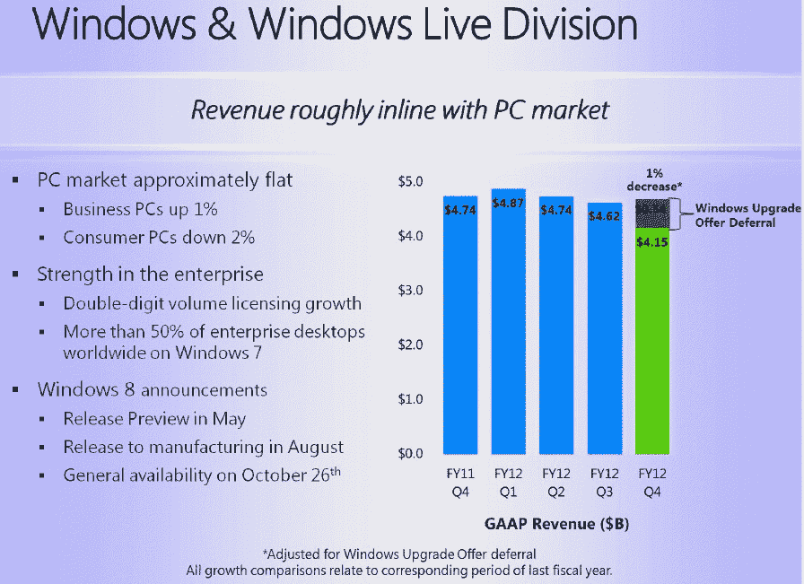
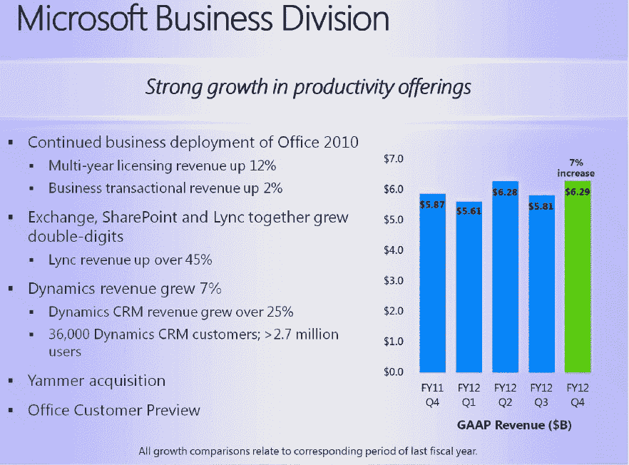
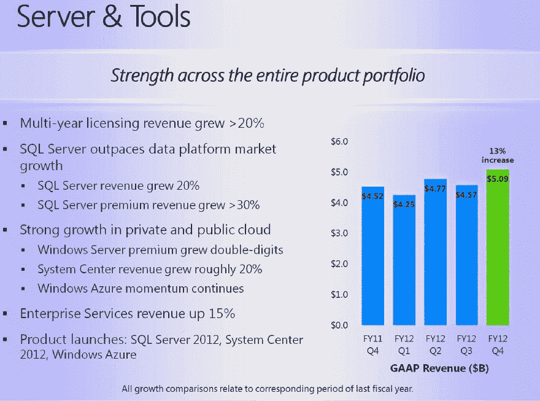
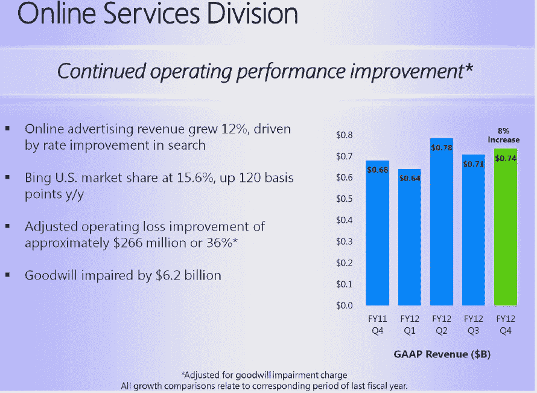
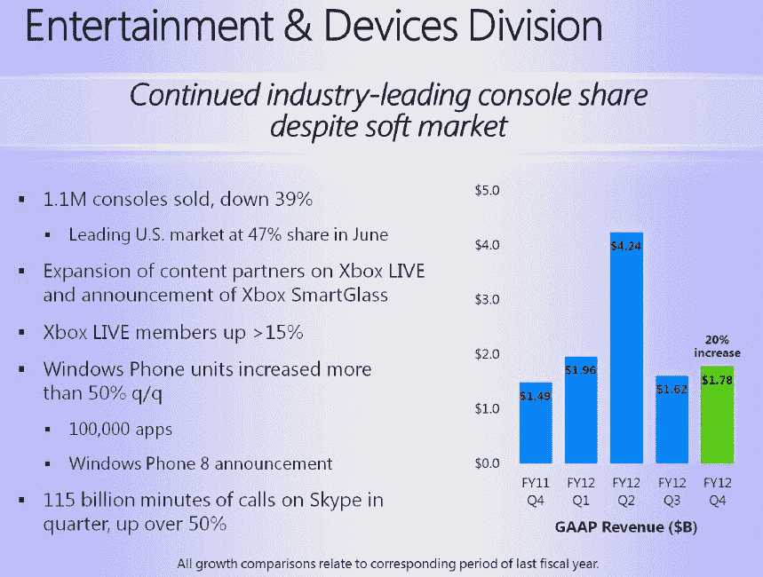

# 微软公布 2012 年第四季度亏损 4.92 亿美元，原因是 619 亿美元的资产减记，180.6 亿美元的收入 

> 原文：<https://web.archive.org/web/https://techcrunch.com/2012/07/19/microsoft-posts-192m-q4-2012-loss-because-of-6-19b-aquantive-writedown-18-06b-revenue/>

微软刚刚发布了 2012 年第四季度的收益报告，公布的税前营业收入仅为 1.92 亿美元，由于收购 aQuantive 失败，该公司首次出现亏损(4.92 亿美元)。本季度收入为 18.06 美元，高于上一季度的 174.1 亿美元和 2011 年第四季度的 173.7 亿美元。每股亏损为 0.06 美元，这是微软历史上首次报告每股收益为负。

分析师此前预计，微软的收入约为 181.3 亿美元，每股收益约为 0.62 美元，收益约为 53 亿美元。然而，这些数字并没有反映量化减记。去年第四季度，微软公布利润为 59 亿美元，2010 年第四季度为 45 亿美元。

在整个财年，微软报告的收入、运营收入和每股收益分别为 737.2 亿美元、217.6 亿美元和 2.00 美元。调整商誉减值费用(即 aQuantive 减记)和递延收入后，微软表示，2012 财年非 GAAP 收入、营业收入和每股收益分别为 742.6 亿美元、285 亿美元和 2.78 美元，比调整后的 2011 财年非 GAAP 数据分别增长了 6%、5%和 5%。

“我们交付了创纪录的第四季度和年度收入，我们很快就要迎来微软历史上最激动人心的发布季，”微软首席执行官史蒂夫·鲍尔默在一份录音声明中说。“在接下来的一年里，我们将发布下一版本的 Windows、Office、Windows Server、Windows Phone 以及许多其他产品和服务，这些产品和服务将推动我们的业务向前发展，并为我们的客户和合作伙伴提供前所未有的机遇。”

在今天的声明之前，一些分析师已经预计微软将公布其 26 年历史上的首次亏损，原因是其 2007 年对数字广告公司 aQuantive 的收购失败。正因为如此，第四季度的数字包括 62 亿美元的减记，以反映微软在线服务部门的较低价值。在线服务部门，也是必应的总部，在过去的几年里增加了收入，但是[上个季度仍然亏损了 4 . 79 亿美元。本季度，在线服务部门的收入又增长了 8%，亏损降至 2.66 亿美元。](https://web.archive.org/web/20221205114846/https://beta.techcrunch.com/2012/04/19/microsoft-beats-estimates-with-17-4b-in-revenue-0-60-eps/)

以下是微软所有部门的数字:

*   **Windows 和 Windows Live**:41.5 亿美元的收入，由于 Windows 升级延期而下降 1%(见下文)
*   业务部门:收入 62.9 亿美元，增长 7%
*   **服务器&工具**:收入 50.9 亿美元，增长 13%
*   **在线服务**:收入 7.4 亿美元，增长 8%
*   **娱乐和设备**:收入 17.9 亿美元，增长 20%

上个月，微软[还宣布](https://web.archive.org/web/20221205114846/http://www.reuters.com/article/2012/06/01/us-microsoft-revenue-idUSBRE8500U420120601)将推迟预计从 14.99 美元的 Windows 8 升级报价中获得的 4.5 亿至 5.5 亿美元。

不过，除了减记对 aQuantive 的收购，微软上个季度当然过得非常有趣。该公司以 12 亿美元收购了 Yammer，并对 Barnes & Noble 进行了 3 亿美元的投资。该公司还从 TechCrunch 母公司 AOL 手中收购了价值 10 亿美元的专利，然后以 5.5 亿美元的现金将这 925 项专利中的 650 项出售给了脸书(并将剩余部分授权给了脸书)。此外，微软还公布了其 [Surface 平板电脑](https://web.archive.org/web/20221205114846/https://beta.techcrunch.com/2012/06/18/the-microsoft-surface-a-10-6-inch-windows-8-tablet-from-microsoft/)，将在 10 月份 Windows 8 发布后上市销售。

随着 Windows 8 即将推出，一些 PC 买家可能会将购买时间推迟到秋季，这是 PC 销售放缓的部分原因。微软的 Windows 部门，也包括 Windows Live，上个季度有所增长。

