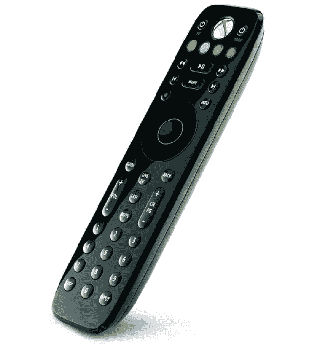

# 微软为 Xbox 360 发布新的蓝牙耳机和媒体遥控器 TechCrunch

> 原文：<https://web.archive.org/web/https://techcrunch.com/2011/07/26/microsoft-releases-new-bluetooth-headset-and-media-remote-for-xbox-360/>

# 微软为 Xbox 360 发布新的蓝牙耳机和媒体遥控器

旧的白色 Xbox 媒体遥控器通常是天赐之物。媒体遥控器让你可以轻松控制网飞和 DVD 视频，而不是按控制器上的奇怪按钮，它足够大，足够独特，不会丢失。然而，这种新的媒体遥控器看起来不太像一块德芙肥皂，更像一个传统的遥控器。

在 [MajorNelson 的博客](https://web.archive.org/web/20230203102120/http://majornelson.com/2011/07/26/xbox-360-wireless-headset-with-bluetooth-and-a-new-media-remote/?utm_source=feedburner&utm_medium=feed&utm_campaign=Feed%3A+MajorNelson+%28Major+Nelson+%28Xbox%29%29)上宣布，这款遥控器售价 19.99 美元，将于 11 月上市。

同时发布的还有一款用于游戏的小型蓝牙耳机。它的价格是 59 比扎克，最棒的是，尼尔森先生在下面展示了它。

【YouTube = http://www . YouTube . com/watch？v=opKtVzZtDHo]

