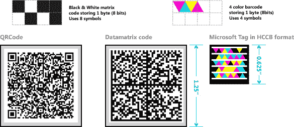

# 微软发布其第二款 iPhone 应用程序 Tag

> 原文：<https://web.archive.org/web/https://techcrunch.com/2009/01/08/microsoft-releases-tag-its-second-iphone-application/>

# 微软发布其第二款 iPhone 应用 Tag

在 CES 上，微软推出了它的第二款 iPhone 应用程序，上个月发布了 Seadragon Mobile 的[版本。该应用程序的名称是](https://web.archive.org/web/20230304182312/https://techcrunch.com/2008/12/13/microsoft-dips-its-toe-into-the-iphone-with-seadragon/)[微软标签](https://web.archive.org/web/20230304182312/http://www.microsoft.com/tag/)，它使用户能够即时访问移动内容、视频、音乐、联系信息、地图、社交网络、促销活动等。只需将设备的摄像头指向自定义标签。

如果这让你思考二维码背后的原理，你不是唯一一个。像二维码一样，微软标签是独特的二维码，可用于打开网址或多媒体文件。最大的区别在于它背后的技术:微软标签是基于微软研究院内部开发的一种全新技术，称为[高容量彩色条形码](https://web.archive.org/web/20230304182312/http://en.wikipedia.org/wiki/High_Capacity_Color_Barcode) (HCCBs)，并提供了一个重要的转折。

微软标签比二维码小，使用三角形和颜色来存储数据，而不是方形像素。实际上，微软标签实际上不存储任何信息，除了一个唯一的 ID，它可以获取更多存储在微软服务器上的数据。这使得标签比二维码能附加更多的信息。

微软标签可用于 iPhone 以及 Windows Mobile、J2ME、黑莓和 Symbian S60 手机。使用手机浏览器访问 [Gettag.mobi](https://web.archive.org/web/20230304182312/http://gettag.mobi/) 即可访问该应用程序；对于 iPhone，在 App Store 中搜索“标签阅读器”。

【YouTube = http://www . YouTube . com/watch？v=m7FZp7TjDtY&w=480&h=295]

(感谢 [Neowin](https://web.archive.org/web/20230304182312/http://www.neowin.net/news/main/09/01/08/microsoft-introduces-2nd-iphone-app---microsoft-tag) 的提醒，上图在 [istartedsomething](https://web.archive.org/web/20230304182312/http://www.istartedsomething.com/20090108/microsoft-tag-microsofts-own-2d-barcode/) 上找到)