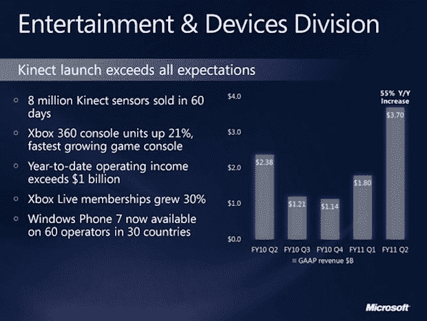

# 微软在 60 天内售出 800 万台 Kinect 

> 原文：<https://web.archive.org/web/https://techcrunch.com/2011/01/27/microsoft-sold-8-million-kinects-in-60-days/>

# 微软在 60 天内售出了 800 万台 Kinects

微软的收益在收盘前 10 分钟提前发布，除了第二季度收入增长 5%至 199 亿美元之外，该公司的幻灯片显示了娱乐和设备部门的一些令人印象深刻的增长数字，该部门本季度收入为 370 万美元，而去年为 240 万美元，并在推出后的两个月内售出了 800 万台 Xbox 360 的运动控制器 Kinects。

总的来说，本季度该部门的收入增长了 55%。这个数字包括 Xbox 360、Kinect、Zune 和 Windows Phone 7 的销量。Xbox Live 会员增长了 30%，Xbox 360 主机销量增长了 21%，根据微软的说法，这使*成为“世界上增长最快的游戏主机”*。对于那些已经放弃微软理解消费电子产品的人来说，它在游戏和设备领域日益增长的主导地位是隧道尽头的一盏灯。

微软首席财务官彼得·克莱恩谈到该部门的成功时说，

> *“我们对消费者对我们假日系列产品的反应充满热情，包括 Kinect 的推出。在短短 60 天内售出的 800 万台 Kinect 传感器远远超出了我们的预期。商业支出的步伐，加上强劲的消费者需求，导致了又一个季度的营业利润率扩张和每股收益的稳步增长。”*

小心 Wii 。