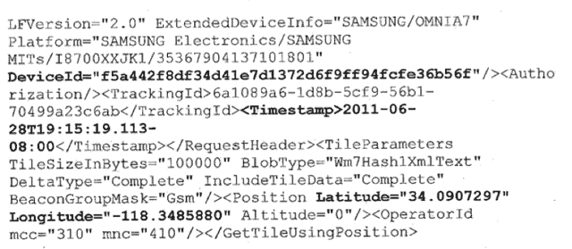

# 微软起诉未经许可收集 WP7 位置数据 

> 原文：<https://web.archive.org/web/http://techcrunch.com/2011/09/01/microsoft-sued-for-collecting-wp7-location-data-without-consent/>

# 微软起诉未经同意收集 WP7 位置数据

虽然苹果因未经许可收集 iPhone 和 iPad 用户位置数据而受到了很多指责，但事实证明，竞争对手微软可能也在悄悄地做同样的事情。最近在西雅图地区法院提起的集体诉讼称，微软的 Windows Phone 7 操作系统收集用户的位置数据，即使在向用户提供选择退出的机会后也是如此。

微软可以处理位置数据本身并不是什么大秘密，但让这个案例如此令人震惊的是，用户显然有一个选择，但随后就被完全忽略了。

令人不快的代码存在于 Windows Phone 7 的摄像头应用程序中。当第一次启动时，WP7 的相机应用程序会询问用户是否希望允许设备使用他们的位置。无论实际选择哪个选项，设备都会开始收集数据。大部分调查都是由 [Samy Kamkar](https://web.archive.org/web/20230205015345/https://twitter.com/#!/samykamkar) 完成的，他能够确定不仅位置和标识符数据被传输，甚至在用户有机会在屏幕上做出决定之前就已经开始了。

Kamkar 的数据包分析，如上图所示，显示了正在传输的信息:设备的型号(在这种情况下是三星 Omnia 7)，设备 ID 号，时间和日期信息，以及经度和纬度读数。

该诉讼称，微软的行动是创建位置感知营销系统计划的一部分，该系统将根据设备的物理位置生成广告。这是否是真的还有待观察，但对于微软来说，为如此平凡的事情冒这么大的风险似乎太大了。

在类似的情况下，苹果因同样的罪行被成功起诉，尽管是在略有不同的司法管辖区。具有讽刺意味的是，在 Locationgate 首次成为头条新闻后，微软给国会发了一封信，其中声明 Windows Phone 7 不会存储任何位置数据，除非用户“明确允许应用程序收集”这些数据。微软还没有发布官方声明，但这可能是因为他们在从高高在上摔下来后正忙着掸灰尘。

[via [信息周刊](https://web.archive.org/web/20230205015345/http://www.informationweek.com/news/security/privacy/231600657)