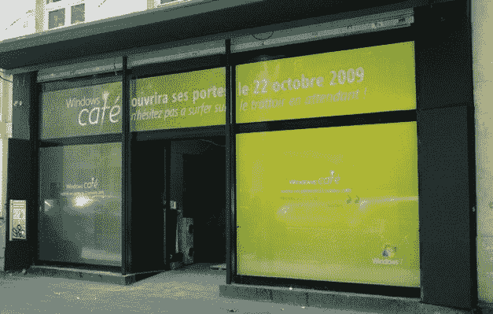

# 微软将在巴黎开咖啡馆打造 Windows 7 Buzz

> 原文：<https://web.archive.org/web/https://techcrunch.com/2009/09/23/microsoft-to-open-cafe-in-paris-to-build-windows-7-buzz-pics/>

# 微软将在巴黎开咖啡馆为 Windows 7 造势

[微软](https://web.archive.org/web/20221207210800/http://microsoft.com/)即将在全球几个主要城市开设[零售店](https://web.archive.org/web/20221207210800/http://www.crunchgear.com/2009/02/12/microsoft-to-open-retail-stores/)，但在巴黎，他们正在做一些特别的事情，以期待真正的商店和即将推出的 [Windows 7](https://web.archive.org/web/20221207210800/http://www.microsoft.com/windows/windows-7/default.aspx) 操作系统。微软法国公司在城市中心(塞瓦斯托波尔大道 47 号)公开准备了一家真正的咖啡店/咖啡馆，让法国首都的居民和游客大吃一惊。

Windows 咖啡馆将从 10 月 22 日开始对公众开放几周，游客可以玩一些微软产品(Xbox、移动设备等)，但除了小吃和饮料，他们不能在那里购买任何东西。

不过，我很想知道这些会被叫做什么。我们能啜饮阿炳卡布奇诺吗？吞下一杯 Windows Live 水果鸡尾酒？或者尝一尝黑莓派服务包 2？

我的猜测和你的一样好。

至少肯定会有免费 Wi-Fi，因为窗户上写着:“Windows 咖啡馆将于 10 月 22 日开门营业。在此期间，不要犹豫在人行道上浏览网页。”

祝你好运！

(Hat tips to[accessweb](https://web.archive.org/web/20221207210800/http://www.accessoweb.com/Le-Windows-Cafe-de-Paris-vous-voulez-l-adresse_a5639.html)和[ViacomIT](https://web.archive.org/web/20221207210800/http://viacomit.net/2009/09/23/windows-cafe-paris/)for the tip/pics)

< img src = " http://tctechcrunch . files . WordPress . com/2009/09/windows-cafe-1 . jpg "

< img src = " http://tctechcrunch . files . WordPress . com/2009/09/windows-cafe-2 . jpg "

< img src = " http://tctechcrunch . files . WordPress . com/2009/09/windows-cafe-3 . jpg "

< img src = " http://tctechcrunch . files . WordPress . com/2009/09/windows-cafe-4 . jpg "