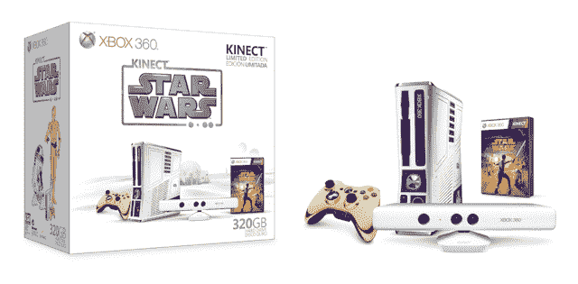

# 微软推出 Kinect 星球大战套装，包括商标 Droid beepes TechCrunch

> 原文：<https://web.archive.org/web/https://techcrunch.com/2011/07/21/microsoft-unveils-the-kinect-star-wars-bundle-trademark-droid-beeps-included/>

# 微软推出 Kinect 星球大战套装，包括商标 Droid Beeps

我是 C-3PO，人机关系。这是我的同事 R2D2。很明显我们又被乔治少爷骗了。这可能是 R2 的错。那个出故障的小笨蛋。我告诉他不要出卖我们，让我们变成廉价的游戏配件，但他有缺陷，有故障。不停地唠叨他的任务。我们似乎注定要受苦。这是我们的命运。

LucasArts 和 Xbox 刚刚发布了 Kinect 星球大战限量版 Xbox 360，配有金色控制器、白色 Kinect 传感器和 R2-D2 主题的 Xbox。这个套装当然附带了 *Kinect 星球大战*，但也有 *Kinect 冒险*——就好像扮演一个绝地武士会变老一样。星球大战的主题不仅仅是一个花哨的油漆工作。当打开或使用光驱托盘时，控制台会发出 R2 特有的嘟嘟声。

320GB 特别版将于“今年晚些时候”上市，售价 449 美元。
