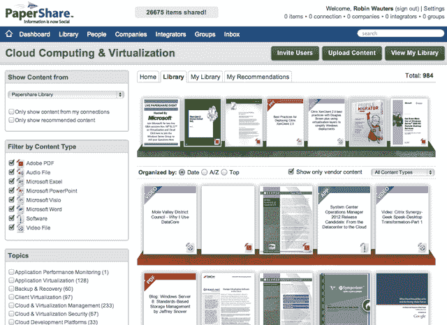

# 微软前虚拟化主管将推出 PaperShare，这是一个“社交内容网络”

> 原文：<https://web.archive.org/web/http://techcrunch.com/2011/11/11/microsofts-former-virtualization-director-to-launch-papershare-a-social-content-network/>

# 微软前虚拟化主管将推出“社交内容网络”PaperShare

大约两周后，我们将看到面向技术专业人士的社交内容和信息网络 [PaperShare](https://web.archive.org/web/20230203101208/http://www.papershare.com/) 的正式推出，尽管如果你愿意，现在就可以访问该网站(关于该风险投资的消息实际上[几个月前就已经传出](https://web.archive.org/web/20230203101208/http://virtualization.com/2011/06/29/former-microsoft-virtualization-director-dabcc-founder-start-papershare/))。

PaperShare 是由[大卫·格雷施勒](https://web.archive.org/web/20230203101208/http://www.linkedin.com/pub/david-greschler/0/784/4a1)(Softricity App-V 的联合创始人，直到最近还是微软的虚拟化和云战略总监)和道格·布朗(热门虚拟化网站 [DABCC](https://web.archive.org/web/20230203101208/http://www.dabcc.com/) 的创始人)创办的。

PaperShare 背后的想法是促进以企业为中心的内容的共享，包括技术白皮书、视频、案例研究等等。PaperShare 不仅仅是一个营销渠道，它还希望成为一个行业专业人士可以通过信息联系的地方。

我听说 Citrix、微软和 VMware 是首批注册 PaperShare 社区的公司成员。

已经有 26，600 篇围绕云和虚拟化主题的文章在网络上发布和共享，在不久的将来，这些文章将扩展到安全、数据库、金融和医疗保健领域。

更多关于 PaperShare 的信息可以在[这里](https://web.archive.org/web/20230203101208/http://vmblog.com/archive/2011/06/29/q-a-with-david-greschler-and-doug-brown-founders-of-the-new-social-site-papershare.aspx)找到。

