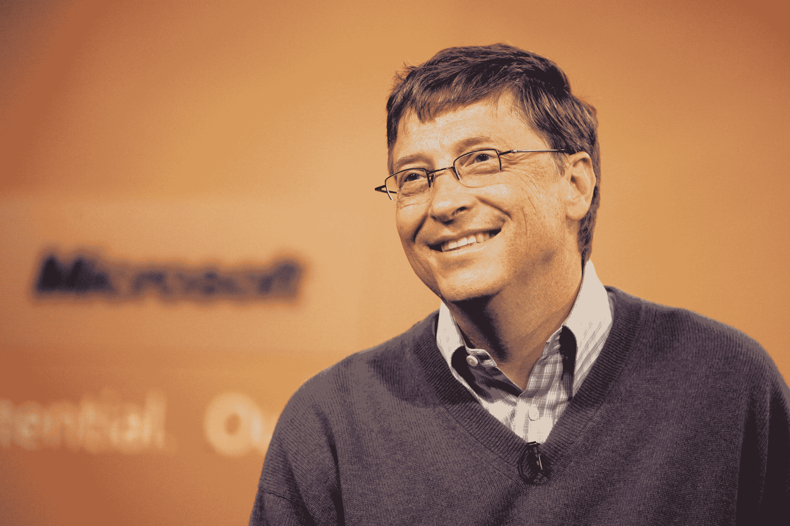

# 微软任命塞特亚·纳德拉为新任首席执行官

> 原文：<https://web.archive.org/web/https://techcrunch.com/2014/02/04/microsofts-new-ceo-is-officially-satya-nadella/>

正如我们所有人[非常期待的那样](https://web.archive.org/web/20230321052516/https://techcrunch.com/2014/01/30/microsofts-next-ceo-reportedly-will-be-its-cloud-boss-satya-nadella-gates-could-be-replaced-on-board/)，微软已经正式宣布:取代史蒂夫·鲍尔默的新任首席执行官是[塞特亚·纳德拉](https://web.archive.org/web/20230321052516/http://www.microsoft.com/en-us/news/ceo/index.html)。纳德拉在微软工作了 22 年，之前是微软负责云和企业的执行副总裁。纳德拉也是微软董事会的一员，创始人比尔盖茨将增加他在公司的参与度。

纳德拉被认为是推动该公司转向云服务的关键领导者，其产品包括 Bing、Xbox 和微软 Office。他在微软任职期间，微软商业服务也经历了一段巨大的增长期，在短短五年的时间里，这部分业务从 15 亿美元增长到 50 亿美元。

在公司发布的一封[致微软员工的电子邮件中，史蒂夫·鲍尔默宣布了这一消息，并表示他“对微软的未来感到振奋”(典型的鲍尔默，我们会想念你这个大家伙)。他称赞纳德拉的技术和商业技能，并对微软大胆的大动作表达了表面上的情感。](https://web.archive.org/web/20230321052516/http://www.microsoft.com/en-us/news/press/2014/feb14/02-04mail1.aspx)

在他自己写给微软员工的电子邮件中，纳德拉回顾了他在公司的时光，并谈到了他是如何要求盖茨回来并花更多时间在公司的。他指出了创新对微软的重要性，并提出移动和云都是 Redmond 前进的关键优先事项。这里有一段摘录，是关于他对我们的计算发展方向的看法。

> 我相信在接下来的十年里，计算将变得更加普遍，智能将变得无处不在。软件和新硬件外形的共同进化将使我们在商业、生活和世界中所做和经历的许多事情中间化和数字化。这将通过不断增长的互联设备网络、来自云的难以置信的计算能力、来自大数据的洞察力以及来自机器学习的智能来实现。

按照纳德拉的说法，微软在引领这个新的计算未来方面处于独特的地位。他在邮件中继续写道:

> 我们是唯一能够驾驭软件力量并通过设备和服务交付软件的人，这些设备和服务真正赋予每个人和每个组织力量。我们是唯一一家有着悠久历史并持续专注于构建平台和生态系统以创造广泛机会的公司。

【YouTube http://www.youtube.com/watch?v=T8JwNZBJ_wI&w=640&h=390]

纳德拉的任命可能标志着其服务器和工具业务的翻倍，该业务目前占微软总收入的 190 亿美元。这位新的首席执行官也在微软围绕数字版权管理和互动电视的工作中发挥了重要作用，然而，正如所提到的，他也在 Xbox 部门工作，所以他是一个比许多人可能意识到的更全面的最佳人选。纳德拉自己的信息也反复触及云设备和移动设备的双重要点，这是一个很好的迹象，表明该公司不希望看起来他们将忽略他们业务的硬件方面。

除了纳德拉被任命的消息，[微软还宣布创始人兼前首席执行官比尔·盖茨将作为“创始人和技术顾问”加入，](https://web.archive.org/web/20230321052516/https://techcrunch.com/2014/02/04/bill-gates-steps-up-to-new-role-at-microsoft-as-technology-advisor-thompson-becomes-new-chairman/)这一角色将使他在产品开发方面发挥更积极的作用。此举似乎旨在抵消纳德拉在硬件方面缺乏经验的任何看法，事实上，如果盖茨真的要花更多的时间在板凳上，这个团队应该是一个强大的团队。根据新的安排，盖茨显然将有 30%的时间在微软工作。

【YouTube http://www.youtube.com/watch?v=M5BhQVuRcTk&w=640&h=390]

纳德拉是微软 39 年来第三位担任首席执行官的人，之前的两位是鲍尔默(2000 年 1 月至 2014 年 1 月)和盖茨(1975 年至 2000 年)。

微软将于太平洋时间[下午 12:00 主持网络直播，讨论高管变动](https://web.archive.org/web/20230321052516/http://www.microsoft.com/en-us/news/ceo/index.html)，请届时收听，了解更多关于雷德蒙最新领导人的消息，或关注我们在此的报道。

**阅读更多:**

微软创始人比尔·盖茨扮演新角色

