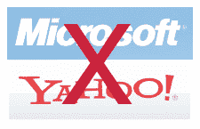

# 微软/雅虎:今日新闻摘要&吉尔摩帮 

> 原文：<https://web.archive.org/web/https://techcrunch.com/2008/05/03/microsoftyahoo-summary-of-news-bonus-gillmor-gang/>

# 微软/雅虎:今日新闻摘要&奖金吉尔摩帮

 **今日新闻摘要:**雅虎和微软之间的谈判今天破裂，人们普遍预期谈判将在周一达成[协议。有一些发言，都归纳如下。史蒂夫·吉尔摩还在晚上 7 点召集了一次吉尔摩帮的特别会议来分析新闻——文字稿仍在制作中，但录音现在已经上线并直播了。](https://web.archive.org/web/20221209120312/http://www.beta.techcrunch.com/2008/05/02/microsoftyahoo-no-deal-today-markets-look-for-announcement-early-monday/)

在这里聆听微软/雅虎特别的吉尔摩团队，史蒂夫·吉尔摩、迈克尔·阿灵顿、多克·瑟尔斯、丹·法伯、达纳·加德纳、罗伯特·安德森和罗伯特·斯考伯都参与其中。

今日新闻(编年):

1.  [爆料:微软撤回雅虎竞购；放弃交易:微软撤回 2 月 1 日的报价，不会超过 33 美元/股，雅虎想要 37 美元。这篇文章还包括微软首席执行官史蒂夫·鲍尔默今天递交给雅虎首席执行官杨致远的一封信。](https://web.archive.org/web/20221209120312/http://www.beta.techcrunch.com/2008/05/03/breaking-microsoft-walks/)
2.  [史蒂夫·鲍尔默给所有微软员工的邮件](https://web.archive.org/web/20221209120312/http://www.beta.techcrunch.com/2008/05/03/email-from-steve-ballmer-to-all-microsoft-employees/):我们掌握的史蒂夫·鲍尔默给所有微软员工的泄露邮件。他向部队解释交易消息。
3.  [雅虎艰难的一周即将到来](https://web.archive.org/web/20221209120312/http://www.beta.techcrunch.com/2008/05/03/yahoos-tough-week-ahead/):雅虎下周面临惨淡的世界；期待股票价格下跌。他们与谷歌有备份协议吗？
4.  [雅虎回应:“微软主动提议的干扰已经过去了”](https://web.archive.org/web/20221209120312/http://www.beta.techcrunch.com/2008/05/03/yahoo-responds/):雅虎发布了一份新闻稿，暗示讨厌的微软干扰已经过去。
5.  或者，跳过以上所有内容，只阅读 [CNET 对今天事件的漫画摘要](https://web.archive.org/web/20221209120312/http://www.news.com/8301-13953_3-9935189-80.html):

