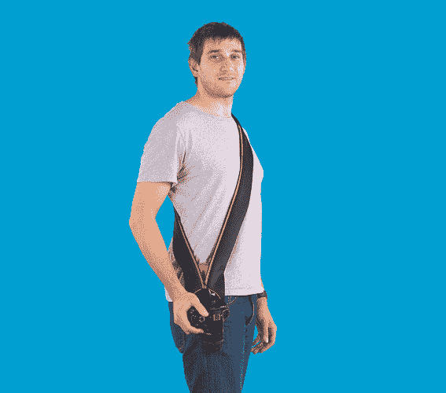

# Miggo 相机带也能保护您的设备，因此您不需要笨重的相机包 TechCrunch

> 原文：<https://web.archive.org/web/https://techcrunch.com/2014/01/31/miggo-camera-strap-protects-your-gear-too-so-you-dont-need-a-bulky-camera-bag/>

# Miggo 相机带也可以保护你的设备，所以你不需要一个笨重的相机包

Kickstarter 的一个新项目将一个有用的东西变得更加有用，它提供了一个皮带，不仅可以携带你的 DSLR，还可以在不使用时保护它。当你外出旅行拍摄时，这是最小化你的设备的完美方式，不需要你的全部相机包和装备，而且它看起来如此简单，令人惊讶的是它还不存在。

Miggo 表带由以色列工业设计师 Ohad Cohen 设计，他是专业相机包制造商 Kata 的创始人，该公司仍然是专业和业余爱好者包的领先制造商之一。科恩是卡塔公司的第一位产品设计师，后来负责研发，所以他对制作摄影器材略知一二。

Miggo 的设计理念是，尽管自智能手机出现以来，人们对摄影有着浓厚的兴趣，但由于使用移动设备的便利性，人们会避免使用高质量的相机和设备。为了缓解这种情况，Miggo 结合了一个吊带来固定你的相机，并在不使用时用一个包裹来保护它。它还为那些喜欢将相机绑在手腕上以防掉落的人提供了一种手柄。这两个版本都可以快速地将相机镜头和机身绑在一起，提供一个安全的保护层，这样你就可以将相机和其他所有东西一起放入单肩包或背包中，而不是使用专门为保护设备而设计的分段式填充相机包。

它有一个内置的三脚架适配器，所以你不必取下它来拍摄延时或其他稳定的照片，并且有标准单反相机和较小机身的紧凑型无反光镜可互换镜头相机的版本，如索尼的 NEX 系列。早期支持者可以以 30 美元的价格预购，直到供应结束，届时手柄+包裹的价格将升至 35 美元或皮带+包裹的价格为 40 美元。

我厌倦了拖着 70 磅的身体。机场周围的摄影器材包，这似乎是一个非常有吸引力的选择，当我觉得我不需要我的整个套件。该公司预计在今年 6 月份之前发运 Miggo，开发工作已经进展到原型基本上可以发运的阶段(一旦建立了适当的生产线)。Miggo 在可负担性、便利性和智能设计之间找到了最佳平衡点，因此他们很可能会很快达到 2 万美元的目标。