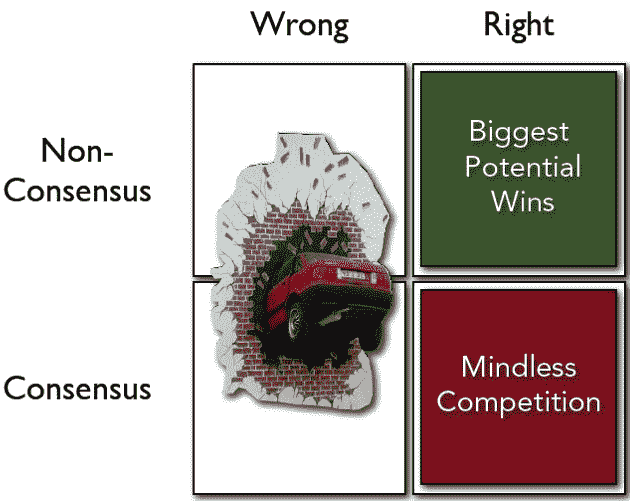

# Mike Maples 成为风险投资家，推出 flood gate 

> 原文：<https://web.archive.org/web/https://techcrunch.com/2010/03/24/mike-maples-floodgate/>

[迈克·梅普斯](https://web.archive.org/web/20221209004008/http://www.crunchbase.com/person/mike-maples)，Motive 的联合创始人之一，在过去的五年里，一直打着[梅普斯投资](https://web.archive.org/web/20221209004008/http://www.crunchbase.com/financial-organization/maples-investments)的旗号，将投资“作为一种爱好”。一些爱好:他的[投资](https://web.archive.org/web/20221209004008/http://www.maplesinvestments.com/companies.html)包括 Twitter、Digg、Chegg、Gowalla、ngmoco、Smule、Kwedit 和十几家其他知名初创公司。他已经通过在第二轮风险投资中出售部分股票，兑现了其中一些投资。

起初，他把自己的钱用于工作。然后，他在 2006 年筹集了 1000 万美元的基金，在 2008 年又筹集了 3500 万美元的基金。在这个过程中，他增加了一个合伙人，安·米乌拉·科。

Maples 现在承认他的爱好更多的是一种痴迷，他正在改变他的基金的名字来纪念这个里程碑。再见，枫树投资公司。您好，[闸机](https://web.archive.org/web/20221209004008/http://floodgate.com/)。

有什么变化？不多，这正是问题所在。Maples 从一开始就专注于寻找不需要大量现金就能获胜的颠覆性创业公司。这听起来很聪明，但硅谷的普遍观点仍然是，想要颠覆一个大行业的初创公司需要大量资本。

你可以听听他在今年早些时候由 Adeo Ressi 在硅谷举办的未来融资活动上的一次演讲中概述他的投资方法。他把他正在寻找的创业公司称为“雷蜥蜴”。他说，他希望创业公司像哥斯拉一样，吃掉竞争对手，撕裂城市。[很有意思的视频](https://web.archive.org/web/20221209004008/https://beta.techcrunch.com/2010/02/21/mike-maples-talks-venture-capital-and-thunder-lizards/)。

这整个雷霆蜥蜴哲学的一部分是找到不仅有一个伟大的想法，而且是其他人都认为荒谬的伟大想法的创业公司。这给了初创公司在竞争到来之前成长的空间。如果一个创业想法是错误的，风险投资就失去了，这没关系。但如果这是正确的，所有人都同时加入，竞争就会吞噬利润。他在寻找“非共识权利”的创业公司，他以向大学生出租教科书的 Chegg 为例。何[2007 年](https://web.archive.org/web/20221209004008/http://www.crunchbase.com/company/chegg)投资。两年后，凯鹏华盈加入进来。

上周，我与 Mike 和 Ann 讨论了新推出的 FLOODGATE。这是一次令人着迷的对话(见帖子顶部的视频)。特别是，在我看来，当他们解释他们的新基金的名字(防洪闸，这是一个阻止洪水的闸门)实际上是关于打开防洪闸，而不是一个。他们还谈到了对年轻创业公司的适当照顾和喂养(这是我的话，不是他们的)，以及正确的早期投资者可以为一个试图在世界上找到自己位置的年轻哥斯拉和一个要摧毁的城市带来多少价值。