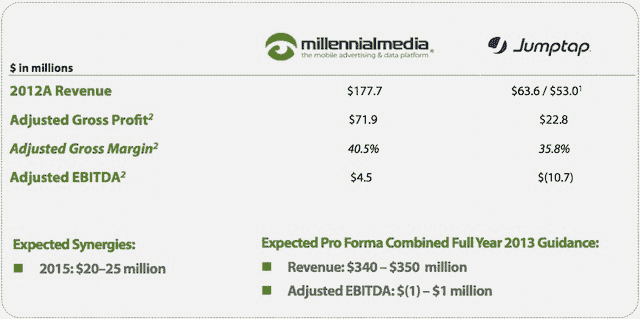
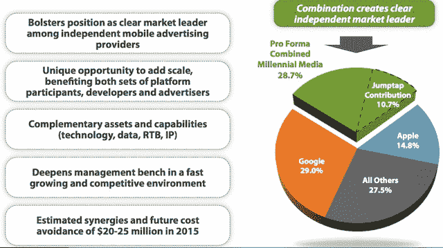

# 千禧传媒将以 2 亿多美元收购移动广告公司 Jumptap 的千禧股票 

> 原文：<https://web.archive.org/web/https://techcrunch.com/2013/08/13/millennial-acquires-jumptap/>

# 千禧传媒将以 2 亿多美元收购移动广告公司 Jumptap 的千禧股票

千禧传媒刚刚宣布，已达成收购 Jumptap 的协议，这笔交易将两家知名的移动广告公司合并在一起。

[收购新闻稿](https://web.archive.org/web/20221208105443/http://www.marketwatch.com/story/millennial-media-signs-definitive-agreement-to-acquire-jumptap-2013-08-13?reflink=MW_news_stmp)将该交易描述为“一项主要的股票交易”，Jumptap 股东将获得 2460 万股公开交易的 Millennial 股票，从而拥有该公司约 22.5%的股份。(以[目前的价格](https://web.archive.org/web/20221208105443/http://finance.yahoo.com/q?s=MM&bucket=bucket-rapid&fr=ush1-finance_uh3_02&type=2button&uhb=uhb2)，这些股票将价值约 2.09 亿美元。)

“千禧传媒已经运营着最大的第三方数字媒体业务之一，尽管移动业务还处于早期阶段，”千禧传媒总裁兼首席执行官保罗·帕尔米里在新闻稿中说。“Jumptap 在性能、跨屏幕、实时竞价和第三方数据方面的专业知识非常适合千禧传媒的现有平台，并为其提供了增量规模。”

Jumptap 成立于 2004 年，已经从包括 General Catalyst Partners、Summerhill Venture Partners、Redpoint Ventures、Valhalla Partners、AllianceBernstein 以及广告巨头 WPP 在内的投资者那里筹集了 1.22 亿美元的资金。从去年开始，[就在为 IPO](https://web.archive.org/web/20221208105443/https://beta.techcrunch.com/2012/07/24/prepping-for-2013-ipo-mobile-ad-player-jumptap-names-ex-yahoo-exec-coo-iadadmob-backer-joins-board/) 做准备，但这些计划似乎被取消了。(我们最近听到了一个传言，但我们无法证实，Jumptap 将被 AppNexus 收购——无论如何，Jumptap 似乎正在与多个潜在买家进行谈判。)

根据 Millennial 刚刚发布的一份[幻灯片，Millennial 在 2012 年的调整后收入为 1.777 亿美元，而 Jumptap 为 6360 万美元(如果不包括门户收入，则为 5300 万美元)。它们 2012 年的净亏损分别为 540 万美元和 1 300 万美元。(经税收和其他费用调整后，Millennial 的 EBITDA 为 450 万美元，Jumptap 的 EBITDA 亏损为 1070 万美元。)该演示文稿预计，合并后的公司收入将在 3.4 亿美元至 3.5 亿美元之间，调整后的 EBITDA 将在 100 万美元至 100 万美元之间。](https://web.archive.org/web/20221208105443/http://investors.millennialmedia.com/phoenix.zhtml?c=238412&p=irol-irhome)

Jumptap 首席执行官乔治·贝尔将以副董事长的身份加入千禧董事会。

Millennial 也[发布了第二季度财报](https://web.archive.org/web/20221208105443/http://investors.millennialmedia.com/phoenix.zhtml?c=238412&p=irol-newsArticle&ID=1847334&highlight=)，营收 5700 万美元，净亏损 310 万美元。

**更新:**在财报电话会议上，帕尔米里强调，两家公司是互补的，特别是考虑到 Millennial 专注于品牌广告，Jumptap 专注于效果广告和实时竞价。他还引用了 Millennial 对第一方数据的关注和 Jumptap 对第三方数据的关注。帕尔米里将合并后的实体描述为“在移动显示领域与谷歌抗衡”——这一点在下面的幻灯片中也有提及。

Millennial 还表示，该交易的股票和现金组合价值跃升至 2.32 亿美元。

