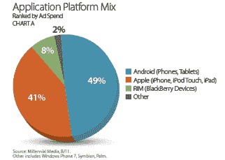
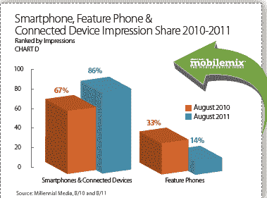

# 千禧一代:安卓移动广告展示量增长 48%，iOS 持平 TechCrunch

> 原文：<https://web.archive.org/web/http://techcrunch.com/2011/09/23/millennial-android-mobile-ad-impressions-up-48-percent-ios-remains-flat/>

移动广告网络 [Millennial Media](https://web.archive.org/web/20230204181637/http://www.millennialmedia.com/) 将发布其月度报告，该报告将展示每个操作系统、设备和制造商在世界上现存最大的独立广告网络之一上的表现。今年 8 月，千禧一代在打破 OS 印象份额时，实际上将联网设备和智能手机结合在一起。这一点很重要，因为 iOS 和 Android 共享可以将平板电脑纳入网络中。上个月，Android 以 54%的份额位居榜首，而 iOS 以 28%的份额位居第二。Rim 以 13%的份额紧随其后。

就增长而言，全球范围内 Android 印象(包括手机和平板电脑)环比增长 48%。iOS 印象环比相对持平，有趣的是 Windows Phone 7 印象出现大幅增长，环比增长 48%。

8 月份，智能手机环比增长 6%，占据了 72%的浏览量。互联设备和功能手机以 14%的印象份额并列。就连接类型的印象而言，32%的印象来自 Wi-Fi。在这些 WI-Fi 展示中，59%来自智能手机(相对于联网设备或功能手机)，环比增长 11%。

联网设备，包括平板电脑、游戏设备和电子阅读器，占网络上 Wi-Fi 印象的 34%。2010 年 8 月，功能手机占千禧一代网络印象的 33%，而这一数字在 2011 年 8 月已降至 14%。

Millennial 还细分了网络应用的广告支出，8 月份 Android 环比增长 2%，占应用平台组合的 49%。iOS 以 41%的份额紧随其后，RIM 占 8%的份额。

8 月，Android 平台上的新闻应用环比增长 26%。一年多来，游戏应用一直是千禧一代网络上排名第一的应用类别，8 月份，游戏占应用展示的 25%，环比增长 19%。

音乐和娱乐应用印象环比增长 13%，在音乐和娱乐类别中，广播应用占 8 月份印象的一半以上。

与 7 月份的调查结果相似，苹果在 8 月份仍然是网络上领先的设备制造商，占前 15 名制造商印象份额的 23%。iPhone 以 13%的印象份额保持了前 20 名手机排名第一的位置。

事实上，HTC 在 8 月份重新夺回了前 15 名制造商排名中的第二名位置，这要归功于该制造商的 5 款设备位列前 20 名手机名单。这些 HTC 手机加在一起，占据了前 20 名手机印象中的 11%。8 月份，所有安卓手机
占据了前 20 名手机印象份额的 32%。

过去的一年代表了新千年媒体的重大发展。该公司刚刚宣布 [2010 年收入为 4780 万美元，](https://web.archive.org/web/20230204181637/https://techcrunch.com/2011/08/27/mobile-ad-network-millennial-media-saw-nearly-50-million-in-revenue-in-2010/)比 2007 年的 150 万美元增长了 3 倍多。我们知道首席执行官兼创始人保罗·帕尔米里有将公司上市的雄心。今年 5 月，彭博报道说 Millennial [正在与银行家](https://web.archive.org/web/20230204181637/http://www.bloomberg.com/news/2011-05-18/millennial-media-is-said-to-talk-with-banks-about-ipo-as-mobile-ads-surge.html)讨论首次公开募股，可能在秋季或 2012 年初进行，对该公司的估值高达 7 亿至 10 亿美元(AdMob 以 7 . 5 亿美元的价格被谷歌收购)。

