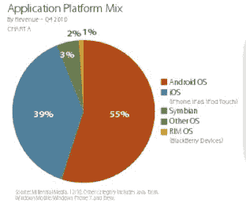

# 千禧一代:Android 首次超越 iOS 移动广告印象份额 

> 原文：<https://web.archive.org/web/https://techcrunch.com/2011/01/13/millennial-for-the-first-time-android-surpasses-ios-mobile-ad-impression-share/>

对于千禧一代媒体来说，这是意义非凡的几周。这家广告网络公司刚刚完成了一轮 2750 万美元的投资，宣布公司在 2010 年的收入增加了两倍，今天，发布了一份更值得关注的月度报告。Millennial，其广告覆盖了美国 7700 万移动网络用户中的 6300 万，占美国移动网络的 81%；据报道，就印象份额而言，Android 在公司历史上首次超过 iOS，成为千禧一代网络上最大的智能手机操作系统。

12 月，Android 操作系统的印象份额环比增长 8%，网络印象份额为 46%，相比之下，iOS 的份额为 32%(比 11 月下降 [6%)。RIM 在 12 月份的印象份额为 16%，比上月下降了 3%。](https://web.archive.org/web/20230202234244/https://techcrunch.com/2010/12/14/millennial-android-and-ios-in-deadlock-again-for-monthly-smartphone-impression-share/)

从第三季度到第四季度，Android 广告请求增长了 141%，自 2010 年 1 月以来，Android 全年增长了 3130%。2010 年第三季度至第四季度，苹果的请求增长了 12%，而自 1 月份以来，苹果仅增长了 14%。苹果的平板设备增长更快，从 2010 年第三季度到第四季度，iPad 的需求增长了 280%。从 2010 年第三季度到第四季度，RIM 的请求增加了 60%，自 1 月份以来增加了 224%。

本月，Millennial 分解了第四季度应用程序产生的收入，有趣的是，Android 的份额为 55%，而苹果为 39%。Android 应用的广告收入环比增长了 13%。

11 月，普通智能手机印象份额环比增长 2%，占手机印象份额的 60%。由于智能手机使用量的增加，触摸屏设备环比增长 10%，12 月份的印象份额约为 57%。

虽然苹果可能已经失去了印象份额的头把交椅，但 Millennial 报告称，苹果仍然是 Millennial 网络上的顶级制造商(过去 15 个月一直如此)，在 12 月份占制造商网络印象份额的 21%。就实际设备而言，iPhone 和 iPod touch 占据了前三大移动设备中的两个。

就制造商而言，三星位居第二，其次是摩托罗拉和 HTC，它们的月环比增长率为 9%。去年 12 月，在排名前 30 的移动设备中，安卓设备占了 16 个，高于去年 11 月的 11 个。在排名前 30 的移动设备中，智能手机占了 23 个，12 月份的印象份额合计为 48%。

关于在千禧一代网络上使用广告的应用程序，Android 应用程序在 2010 年第四季度占应用程序平台组合的 55%，环比增长 13%。

显然，整个报告中最引人注目的统计数据是，Android 在网络上的移动广告印象份额终于超过了 iOS。虽然这是千禧一代网络的第一次，但 Android 一直在稳步蚕食苹果和 RIM 曾经占据的智能手机市场份额。

为什么这在千禧一代的网络上是一件大事？根据[IDC 的一份新报告，](https://web.archive.org/web/20230202234244/http://www.businessweek.com/technology/content/dec2010/tc2010123_780712.htm)千禧一代是仅次于谷歌 AdMob 和苹果 iAd 的第三大网络，因此千禧一代网络份额的转移意义重大。

当然，真正的考验将是 Android 能否在未来几个月保持其统治地位。但 Android 有很大的空间来失去哪怕一点点的印象份额(目前两个操作系统之间有 14%的差距)，所以看起来报告可能会在 1 月份显示类似的调查结果。