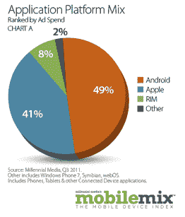

# 千禧一代:过去一年，iPad 的展示量增长了 456 %;iOS 增长 60% 

> 原文：<https://web.archive.org/web/http://techcrunch.com/2011/10/25/millennial-ipad-impressions-grew-456-percent-over-past-year-ios-up-60-percent/>

移动广告网络 [Millennial Media，](https://web.archive.org/web/20230204122459/http://www.millennialmedia.com/)发布了季度报告，该报告展示了每个操作系统、设备和制造商在世界上现存最大的独立广告网络之一上的表现。在第三季度，Android 继续主导移动广告网络，并以 56%的印象率在 Millennial 上领导连接设备和智能手机操作系统组合。iOS 是第三季度第二大联网设备和智能手机操作系统，拥有 23%的印象。

iOS 仍然是连接设备最多的操作系统。第三季度，iOS 印象同比增长 60%。特别是，iPad 浏览量增长了 456%，iPod Touch 浏览量同比增长了 30%。iPhone 在千禧一代的 iOS 印象中占 54%，而 iPod Touch 和 iPad 加起来占了另外 46%。

智能手机季度环比增长 7%，同比增长 37%，在智能手机、功能手机和连接设备印象份额组合中领先，第三季度的印象份额为 72%。互联设备和功能手机在智能手机、功能手机和互联设备印象份额组合中各占 14%。

在第三季度，Wi-Fi 占运营商组合的 32%。在 Wi-Fi 方面，智能手机占千禧一代平台上所有 Wi-Fi 展示的 59%，环比增长 23%。第三季度，包括平板电脑、游戏设备和电子阅读器在内的联网设备占我们平台上 Wi-Fi 展示的 38%。

苹果在第三季度是千禧一代平台上的顶级设备制造商，占前 15 名制造商印象份额的 23%，在前 20 名手机排名中占 12%的印象份额(第一名)。千禧一代网络中排名前 20 的手机中，安卓占据了 15 个。HTC 拥有 6 部这样的手机，作为制造商，年增长率超过 100%。

智能手机制造商华为在过去一年也取得了重大增长，其印象同比增长了近三倍，目前在 15 大制造商排名中排名第七。

当分解应用程序的广告支出时，Android 应用程序占 49%的份额。这是一个 20%的季度环比增长。音乐和娱乐在第三季度的 Android 应用类别中领先，按广告支出排名，
其次是 Android 游戏应用，几乎比上一季度翻了一番。

按广告支出排名，苹果在第三季度占应用平台组合的 41%。尽管游戏仍是 iPad 应用类别的领头羊，但音乐和娱乐已经成为苹果应用类别的领头羊。第三季度，苹果移动社交网络应用环比增长 36%。

一年多来，游戏应用一直是千禧一代平台上排名第一的应用类别。游戏应用占应用展示的 34%，环比增长 26%。第三季度，新闻应用浏览量环比增长 36%,全球新闻应用
占浏览量的四分之一以上。

