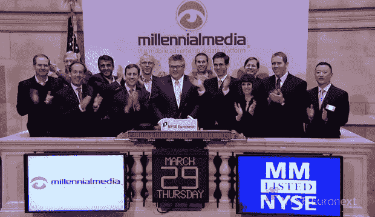

# 千禧传媒的股票在交易的第一天上涨了 100%；2B | TechCrunch

> 原文：<https://web.archive.org/web/https://techcrunch.com/2012/03/29/millennial-media-shares-pop-100-percent-in-first-trade-valued-at-nearly-2b/>

# 千禧传媒的股票在交易的第一天上涨了 100%；价值近 100 万美元的 2B

移动广告网络 Millennial Media 刚刚在纽约证券交易所以“MM”的代码首次亮相，并在第一笔交易中以 25 美元的价格上涨了 97%。在周二[提高了价格区间](https://web.archive.org/web/20230306024908/https://techcrunch.com/2012/03/27/millennial-media-sets-price-range-for-ipo-at-11-to-13-per-share-valued-at-974m/)后，该公司昨晚最初将其 IPO 定价为每股 13 美元。每股 25 美元，Millennial 的估值跃升至近 20 亿美元。在早盘交易中，交易价格高达 27.90 美元。**更新:**千禧公司以每股 25 美元收盘。

Millennial 于 1 月初提交了最初的 S-1 文件，募集了超过 1.3 亿美元的资金，高于早期文件中最初陈述的 7500 万美元。

Millennial 是现存最大的独立移动广告网络之一，目前为全球 2 亿独立用户提供广告服务，其中仅在美国就有大约 1 亿独立用户。超过 30，000 个应用程序由开发人员启用，以接收千禧一代发送的广告。

从 2009 年到 2010 年，Millennial 的收入增长了 195%，从 1，620 万美元增加到 4，780 万美元，而该公司在这两年分别净亏损 760 万美元和 710 万美元。从 2010 年到 2011 年，收入增长了 117%，从 4780 万美元增长到 1.037 亿美元。2011 年，该公司净亏损仅为 28.7 万美元。

这家公司由保罗·帕尔米里创立，总部位于巴尔的摩的公司已经从查尔斯·里弗风险投资公司、NEA、贝塞麦风险投资伙伴、哥伦比亚资本和其他公司筹集了 6500 万美元的风险资金。帕尔米里今天发表声明:*“今天对我们公司来说是激动人心的一天，也是移动广告行业走向成熟的一个重要里程碑。在过去的六年多时间里，我们帮助创建了现在价值数十亿美元的移动应用广告市场，我们期待继续推动该领域的增长和创新。”*

2010 年，帕尔米里开玩笑地称千禧一代为安静的巨人，因为像 Quattro(被苹果收购)和 AdMob(被谷歌收购)这样的竞争对手抢走了聚光灯。很明显，情况不再是这样了。

[YouTube http://www.youtube.com/watch?v=j1_EuLR-dfg&w=560&h=315]