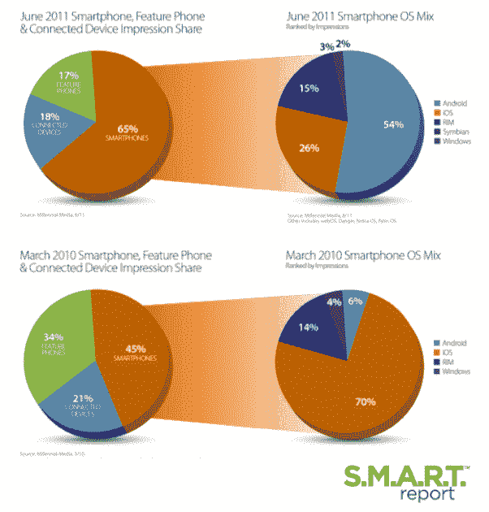
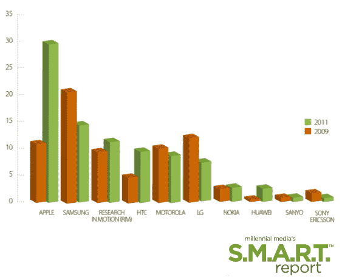

# 千禧一代:Android 在 Q2 获得了 53%的广告印象；iOS 占据 27%的市场份额 TechCrunch

> 原文：<https://web.archive.org/web/http://techcrunch.com/2011/08/12/millennial-q2-report-android-ad-impressions-up-53-percent-ios-up-4-percent/>

# 千禧一代:Android 在 Q2 获得了 53%的广告印象；iOS 占 27%的份额

现存最大的独立移动广告网络 [Millennial Media](https://web.archive.org/web/20230203075659/http://www.millennialmedia.com/) 今天发布了第 50 份报告，为了纪念这一天，公布了一些统计数据，比较了过去几年制造商和操作系统的增长。

例如，2010 年 3 月，iOS 在千禧一代的网络上拥有 70%的移动广告印象份额，而当时 Android 只有 6%。一年过去了，在 2011 年 6 月，Android 已经超过了 iOS，占据了 54%的广告印象份额，iOS 占据了 26%的份额。在这段时间里，RIM 的市场份额基本相同(2010 年为 14%，2011 年为 15%)。

智能手机的份额也从 2010 年 3 月的 45%上升到 2011 年 6 月的 65%。另一方面，功能手机的份额从 2010 年的 34%下降到 2011 年的 17%。

报告中另一个值得注意的数据是——千禧一代网络中 60%的设备使用触摸屏作为输入设备，而 2009 年只有 27%的设备是触摸屏。

虽然 Android 正在迅猛发展，但就千禧一代网络中的制造商而言，苹果增长最快。自 2009 年以来，苹果作为顶级制造商的市场份额增加了近 20 个百分点(从 11%增加到 30%)。三星以前是顶级制造商。

千禧一代也在 2011 年第二季度关注了网络的增长。在 2011 年的 Q2，智能手机季度环比增长 8%，以 67%的印象率领先于智能手机、功能手机和联网设备。联网设备季度环比增长 13 %,在 Q2 智能手机、功能手机和联网设备组合中占 17%。

在 Q2 千禧一代的网络中，Android 保持着领先的智能手机操作系统印象组合的地位，拥有 53%的印象。实际上，iOS 季度环比增长 4%，在 Q2 智能手机操作系统印象组合中占 27%。如果 iPhone 5 在未来一年发布，这一数字可能会大幅上升。

[YouTube http://www.youtube.com/watch?v=-A8FmSBjmfM&w=560&h=349]