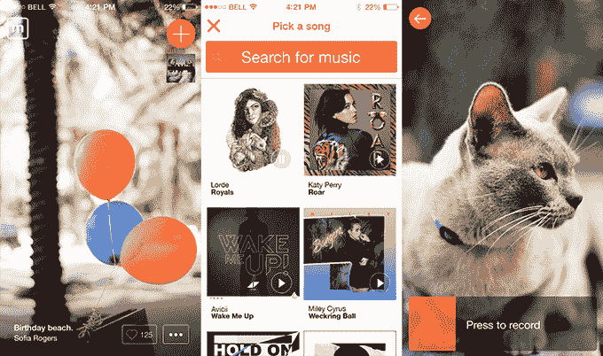

# Mindie 是一款身临其境的音乐和视频点唱机应用

> 原文：<https://web.archive.org/web/https://techcrunch.com/2013/10/17/mindie-is-an-immersive-music-and-video-jukebox-app-done-right/>

认识一下 Mindie，这是一款设计精美的 iPhone 视频分享应用。但称之为视频应用只是故事的一部分。它还不是另一个 Vine、Instagram 甚至是 [MixBit](https://web.archive.org/web/20221225195703/https://techcrunch.com/2013/08/08/youtube-founders-introduce-mixbit-to-crack-the-code-of-video-editing-on-mobile/) 的竞争对手。Mindie 是关于音乐发现的。你选择一首曲目，像在 Vine 中一样录制几秒钟的视频，然后在 Twitter、脸书和明迪上分享这两者的组合。

“音乐是创造力的催化剂，”联合创始人格雷瓜尔·亨里翁在一次电话采访中告诉我。“拍摄一个有趣的视频非常复杂，但如果你在一个糟糕的视频上放音乐，它会变得有趣，”他继续说道。

正如他所说，音乐是视频的故事，而不是图像。换句话说，视频是字幕，而不是音乐。虽然一开始没有声音会令人不安，但这种体验仍然非常个性化，因为音乐是分享情绪和特定心情的一种很好的方式。

当浏览员工推荐时，用户可以在一家时髦的[服装店](https://web.archive.org/web/20221225195703/http://www.mindie.co/c/6TkMyJboX79K)听一首披露音轨，在一家时髦的[咖啡店](https://web.archive.org/web/20221225195703/http://www.mindie.co/c/iGeXh1tAacYD)听一首来自 Chvrches 的好听歌曲，当看着一个骑着 vélib’自行车的巴黎人[时听拉娜·德尔·雷的声音…](https://web.archive.org/web/20221225195703/http://www.mindie.co/c/ka8p95q6yIhc)

> 视频是字幕，不是音乐。

音乐发现应用程序非常难。比如转盘不得不[关闭](https://web.archive.org/web/20221225195703/http://piki.fm/) [Piki](https://web.archive.org/web/20221225195703/https://techcrunch.com/2012/12/03/meet-turntables-piki-the-first-music-app-to-do-social-music-sharing-right/) ，公司的社交音乐 app。这就是为什么当我读到 Mindie 是怎么回事时，我是持怀疑态度的。

但当你打开应用程序时，你会立即获得它。就像在 [Frontback](https://web.archive.org/web/20221225195703/https://techcrunch.com/2013/07/22/frontback-is-a-deeply-personal-photo-taking-app-to-capture-fleeting-moments/) 中，内容占据中心舞台。视频周围没有铬合金，你把自己放在你朋友的鞋子里。视频持续七秒，因为 Instagram 向 Mindie 团队展示了 15 秒的视频太长了。当然，你会听到几秒钟的精选配乐。

当你在屏幕上滑动手指，你会得到另一个视频，另一首歌。这种情况一直持续下去。所有这些都非常顺利。每次你看一个新的视频，感觉就像发现了一个全新的个人经历，有人想和你分享。可以在 iTunes Store 上点赞、分享、购买曲目。

目前，Mindie 没有创建另一个社交图。当你第一次创建你的账户时，你会自动关注你所有已经使用该应用的脸书和 Twitter 好友。制作视频非常简单。首先，您搜索想要选择的曲目。Mindie 使用 iTunes Store API 来获取歌曲预览。然后你像在 Vine 或者 Instagram 里一样拍摄你的视频。最后，你可以添加一个标题，并在 Twitter 或脸书上分享。

当被问及 Mindie 是视频分享应用还是音乐发现应用时，Henrion 的回答很直接:“Mindie 是一款音乐应用。在 App Store 中，我们属于音乐类别。”根据他的说法，Vine 正在成为一个分享喜剧片段的应用程序，与 Mindie 非常不同。它不再是捕捉个人和短暂瞬间的应用程序。这就是为什么该公司甚至没有将 Vine 视为竞争对手。

总部设在巴黎的四人小组还没有筹集到任何资金。但 Mindie 认为，它已经将音乐共享体验简化为其核心机制。正如 Henrion 所说，“让人们录制小视频会让他们想要分享音乐。”

