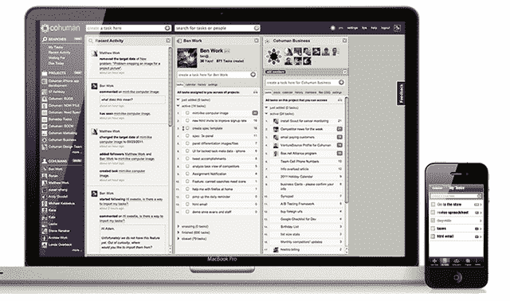

# Mindjet 收购 Cohuman，推出基于云的协作工具 mind jet Connect 

> 原文：<https://web.archive.org/web/http://techcrunch.com/2011/09/11/mindjet-buys-cohuman-to-debut-cloud-based-collaboration-tool-mindjet-connect/>

# Mindjet 收购 Cohuman，推出基于云的协作工具 Mindjet Connect

今天，Mindjet 发布了许多公告，旨在帮助人们更有效地合作。该公司今天上午[宣布](https://web.archive.org/web/20230203080713/http://www.mindjet.com/connect-press-release.html)即将推出一项名为 Mindjet Connect 的云服务，这是一款工作管理软件，通过可视化想法和计划，帮助团队朝着共同目标合作，管理和共享文件，并提供一个随时可用的集中信息中心。

Mindjet Connect 将于 2011 年 9 月 22 日推出相对有限的免费版本(详情见下文)。

Mindjet 还宣布[收购](https://web.archive.org/web/20230203080713/http://blog.cohuman.com/cohuman-is-now-part-of-the-mindjet-family/) [Cohuman](https://web.archive.org/web/20230203080713/http://www.cohuman.com/) 的，这是一个[基于社交任务的网络服务](https://web.archive.org/web/20230203080713/https://techcrunch.com/2011/01/26/task-management-startup-cohuman-raises-600k/)，它让人们能够在项目和任务上更好地与同事协调。

收购条款没有披露。

根据 CrunchBase 的消息，Cohuman 得到了来自 Jupiter Partners、Diamond II Investments 和 Stage One Capital 的近 150 万美元的早期资金支持。该公司表示，Cohuman 将继续作为独立产品积极开发。

今年晚些时候，将进行全面的 Mindjet Connect 集成。

阅读之前的博客文章，在我看来，Cohuman 唯一的选择就是在无法筹集到更多资金后被收购。

回到 Mindjet Connect，它将以完整在线服务的形式出现，并作为 Mindjet desktop 和[移动地图客户端](https://web.archive.org/web/20230203080713/http://www.mindjet.com/mobile-apps)的附加组件。

该服务将提供一个基于网络的可视化框架，用于捕捉和组织想法和信息，以及基于云的文档管理和多用户协作功能，以便团队可以实时合作。

Mindjet Connect 将提供三个版本:免费版、商务版和 SP 版(稍后将详细介绍它们的可用性、功能和定价)。

Mindjet 在我们本周举行的 [Disrupt conference](https://web.archive.org/web/20230203080713/http://disrupt.beta.techcrunch.com/) 上有一个展位，该公司将使用信息映射来实时捕捉和显示初创企业战场，以记录今年所有最佳的初创企业推介。如果你参加了，就去看看吧！

最后，Mindjet 还宣布发布 mind manager 2012 Professional for Windows，这是其[视觉信息软件](https://web.archive.org/web/20230203080713/http://www.mindjet.com/mindmanager)的最新版本。功能包括实时共同编辑，增强的信息地图和一个新的桌面界面，除了新鲜的头脑风暴功能。

MindManager 2012 将与 Mindjet Connect 集成，以提供与“任何人、任何地方、任何设备”的 MindManager 地图的开放共享。

MindManager 2012 将于 9 月 22 日上市，升级价格为 129 美元，新客户为 399 美元。一旦产品上市，我们将再次访问。