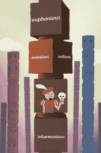

# MindSnacks 从红杉获得 650 万美元，将有趣的教育游戏带到您的移动设备上 

> 原文：<https://web.archive.org/web/https://techcrunch.com/2012/08/02/mindsnacks-series-a/>

因其令人上瘾的 iOS 教育游戏而闻名的 DreamIt Ventures accelerator 毕业生(以一个永远存在的鼻涕虫为特色)今天宣布，它已经从[红杉资本](https://web.archive.org/web/20221224192801/http://www.crunchbase.com/financial-organization/sequoia-capital)筹集了 650 万美元。

早在 2010 年，Jesse Pickard、Jeff Evans、Andy Mroczkowski 和 Karl Stenerud 最初创立了 mind 零食，以帮助他们的朋友和其他游戏玩家将他们对愤怒的小鸟和水果忍者的沉迷转化为更具长期价值的东西。由于对语言学习缺乏选择感到沮丧，他们推出了一款教育应用程序，利用手机游戏的成瘾机制，用人们选择的语言教他们基本的词汇、阅读、写作和理解技能。

他们的特定语言应用程序组合已经增长到 14 个，包括西班牙语、普通话，甚至 SAT 词汇。这些应用背后的目标很简单:将学生的典型学习和材料记忆过程(包括死记硬背、枯燥的抽认卡和课本瞪眼)转变为人们真正喜欢的活动。很疯狂，对吧？这真是太疯狂了，mind 零食的游戏组合今天吸引了超过 400 万次下载，这对一个教育应用程序来说意义重大。

现在，有了新的资本，这家初创公司计划扩大规模，从语言习得和考试准备扩展到普通高中和大学学生课程中的科目。为此，这家初创公司将利用新的现金来增加招聘，特别是在工程和设计方面，增加他们目前由动画师、教育专家和设计师组成的稳定队伍，这些人在内部开发 mind 零食游戏。

 当然，说到资金，这并不是 mind 零食公司的第一次竞技表演。这家初创公司在去年 3 月从一系列知名天使和风投那里筹集了 120 万美元，其中包括 Felicis Ventures、500 Startups、米切尔·卡普尔、协作基金、StartupAngel、Maneesh Arora、DreamIt Ventures、Startl、Theoria Capital 和 David Kim 等。皮卡德告诉我们，从那时起，这家初创公司筹集了一笔 80 万美元的小型融资，让之前的投资者可以重新投资。通过银行的 A 轮融资，mind 零食公司的总融资额达到了 850 万美元。

红杉资本的合伙人布莱恩·施莱尔(Bryan Schreier)领导了该公司的投资，他表示，对他来说，这家初创公司的巨大吸引力在于它有可能真正让学习变得有趣——不仅仅是对孩子，而是对所有年龄段的人。随着 mind 零食吸引了 400 万次下载，18 岁以上和 18 岁以下的人几乎各占一半，它的游戏已经显示出了一些希望的曙光。

此外，皮卡德告诉我们，该公司的六种外语应用程序(西班牙语、法语、意大利语、德语、普通话和葡萄牙语)都是各自应用商店类别中每种语言的票房冠军。就实际价值而言，这位联合创始人表示，如今用户每秒钟学习三个以上的单词，迄今为止已经学习了近 7000 万个单词——并且还在用户中找到了一些忠诚度，32%的用户下载了不止一个应用程序。

为什么？皮卡德将其归因于对用户保持一种同理心，或者说，它认为学习应该——也可以——有趣。虽然这听起来温暖而模糊，但 MindSnacks 认为，它通过设计引人入胜的游戏(请注意，有 slugs)来推动长期记忆和更好的表现，从而与传统的教学软件区分开来。这显然是关键。

虽然游戏化正忙于破坏教育系统，但并不是所有的教师都渴望看到手机和平板电脑出现在他们的课堂上。但皮卡德说，mind 零食不一定要在课堂上使用或作为传统学习工具的替代品，而是在课余时间补充功课，提供一些乐趣，在家里提供额外的指导。

尽管皮卡德强调智力零食不仅仅适用于课堂环境，但他确实看到了在继续教育中的大量潜在应用。他告诉我们，在去年的一次采访中，他开玩笑说，mind 零食是“从 5 岁到 65 岁的每个人”的一个有趣工具，这后来一直困扰着他，因为这家初创公司的收件箱很快就塞满了来自 70 岁老人的愤怒电子邮件，他们希望确保 mind 零食知道他们也是顾客。

事实上，TechCrunch 自己的 Jordan Crook 目前正在使用 mind 零食学习普通话，并表示双语未来的希望现在更加现实。实际上，她每天都用不同的语言在 Skype 上和我打招呼。

目前，这家初创公司的应用涵盖 50 个主题课程，每个应用都有 6 个围绕特定语言处理或理解技能构建的小游戏，例如，这些小游戏(结合自适应课程算法)旨在帮助你快速学习词汇概念、语法和上下文。

然而，如上所述，展望未来，该团队正在寻求将其曲目扩展到语言之外，即将推出的图书将涵盖地理、数学等内容。在展望未来时，皮卡德描绘了在健康跟踪设备爆炸的背景下，mind 零食的可能未来，例如 Nike+ FuelBand，它正在改变人们与健康数据互动的方式，将用户的胆固醇、心率和健身进度都放在一个简单的基于网络的仪表板上。换句话说，这些令人难以置信的、敏感的移动跟踪设备正在将生物数据转化为更具可操作性和结构化的东西，这位联合创始人认为教育领域也在发生同样的事情。

因此，随着该公司收集关于人们如何学习、他们被哪些单词卡住以及他们轻松掌握的语法技能类型的大量数据，皮卡德认为 MindSnacks 最终能够让这些信息变得更容易理解，例如，向你展示你在语言习得的哪些领域挣扎，并提供旨在填补这些空白的练习。简而言之，帮助用户优化教育。我的朋友们，这价值 650 万枚金蛞蝓。

更多信息，[请点击这里](https://web.archive.org/web/20221224192801/http://www.mindsnacks.com/)查看家庭零食。