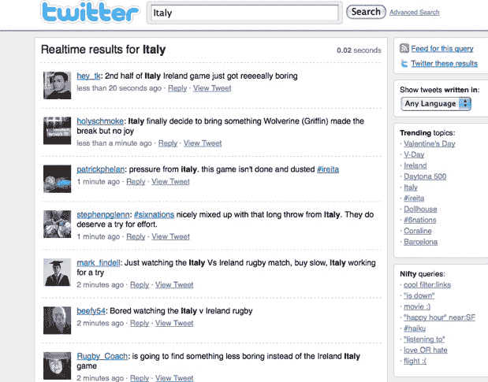

# 挖掘思想流 

> 原文：<https://web.archive.org/web/https://techcrunch.com/2009/02/15/mining-the-thought-stream/>

如果你能在数百万人思考这些想法时或之后不久窥视他们的想法，会怎么样？如果所有这些想法都可以立即在一个数据库中获得，可以很容易地挖掘出来，告诉你人们个人和集体现在对任何可以想象的主题或事件的想法*会怎么样？那么，你就会有一个完全不同的搜索引擎。实时搜索引擎。一个正在发生的事情的搜索引擎。*

 *事实上，这个“现在”搜索引擎的雏形已经存在。它被称为 Twitter，这也是新投资者[周五向这家成立两年的初创公司再投入 3500 万美元](https://web.archive.org/web/20221013013127/http://www.beta.techcrunch.com/2009/02/13/twitter-raises-third-round-of-funding-from-benchmark-and-ivp/)的一个重要原因。Twitter 并不是唯一一家试图解决这个问题的公司。脸书、FriendFeed 甚至谷歌都在试图破解它，但 Twitter 有一个明显的优势，那就是它捕捉了网络上绝大多数的实时思想流(因为更多的人比其他人更直接地将他们的思想输入 Twitter 的数据库，而且速度越来越快)。

谷歌和其他搜索引擎之所以如此有价值，是因为它们抓住了人们的意图——他们在寻找什么，他们渴望什么，他们想了解什么。但它们在捕捉人们在做什么或在想什么方面做得不太好。对于正在发生的想法和事件，搜索 Twitter 越来越多地比搜索 Google 带来更好的结果。

无论你想知道人们在精神上是如何为本周在巴塞罗纳举行的世界移动通信大会做准备的，还是想知道他们对今天在 T2 举行的爱尔兰 T3 对 T4 T5 的橄榄球比赛有什么想法，搜索 Twitter 都会给你一些很好的观点和看法。它也能更快地发布关于突发新闻的重要细节，比如孟买袭击或降落在哈德逊河上的飞机。

Twitter 的搜索引擎由 Summize 提供支持，sum mize 是 it [去年 7 月收购的一家初创公司。](https://web.archive.org/web/20221013013127/http://www.beta.techcrunch.com/2008/07/15/confirmed-twitter-acquires-summize-search-engine/)但它也开发了一个名为 [Track](https://web.archive.org/web/20221013013127/http://evhead.com/2007/09/twitter-track.asp) 的功能，目前被禁用，但[很快会恢复](https://web.archive.org/web/20221013013127/http://www.techcrunchit.com/2008/12/17/why-track-will-be-back-fred-wilson-says-so/)，允许人们关注指定关键词的提及。Summize 的投资者 John Borthwick(现在是 Twitter 的投资者)在本月早些时候的一篇博客文章中解释了为什么他认为“Twitter 搜索改变了一切”摘录:

> 想象一下，你在排队等咖啡，却听到人们谈论一架飞机在哈德逊河上降落。你回到办公桌，在谷歌上搜索哈德逊河上的飞机——今天——事件发生几周后，谷歌上充满了结果——但事件发生当天，在谷歌上找不到任何关于这个主题的内容。然而在 http://search.twitter.com，对话就在你面前。这同样适用于任何热门话题——猪身上的口红？—对于实时问题、实时品牌分析、跟踪新产品发布——几乎任何主题，如果你想知道现在发生了什么，search.twitter.com 都会给出一个优秀的结果集。
> 
> 。。。实时搜索有何不同？历史并不那么重要——相关性主要是由时间决定的。。。。我认为，将搜索重新定义为导航是迈向一个全新的不同未来的一步。Google.com 突然变成了网页的来源——不是对话，也不是实时网络。接下来是什么？我认为背景是下一个障碍。社会背景和基于页面的背景。。。。今天的 Twitter 搜索很粗糙——但不久前的 Google.com 也是如此。

Twitter 可能只是一个愚蠢想法的集合，但总的来说，这是一个有价值的东西。总的来说，你得到的是对消费者情绪、政治情绪、任何一种情绪的直接观察。对于试图了解人们对其品牌看法的公司来说，搜索 Twitter 是一个很好的起点。为了理解我在说什么，试着搜索一下[“iPhone”](https://web.archive.org/web/20221013013127/http://search.twitter.com/search?q=iphone)“T2”【Zune】“T3”或者[“沃尔沃旅行车”](https://web.archive.org/web/20221013013127/http://search.twitter.com/search?q=volvo+wagon)。

为什么 Google 不能简单的索引 Twitter？确实如此，但是它的搜索结果更重视链接而不是时间。它可以创造一种类似博客搜索或新闻搜索的新搜索产品，更适合微消息服务，如 Twitter、FriendFeed 等。但是它真正需要的不仅仅是在事后简单地索引 Twitter。IVP 合伙人、Twitter 投资者托德·查菲建议:

> 如果他们真的聪明，他们可以与 Twitter 合作，让 Twitter 成为他们的实时信息来源。

博思威克认为，要做到这一点，谷歌需要“肯定 Twitter 在这一领域的主导地位以及 Twitter 数据流的重要性”。但到目前为止，谷歌已经错过了这个开放实时搜索的机会。它收购了 Twitter 的竞争对手 Jaiku，结果却让它关闭了。现在，它希望通过开源 Jaiku 来抗衡 Twitter 在实时数据方面日益增长的实力。祝你好运。

听听 Twitter 投资者的意见，可以很好地了解他们认为 Twitter 如何能够成为实时搜索领域的游戏规则改变者。虽然这很有启发性，但也必须指出，这一愿景的大部分尚未实现。博思威克欣然承认，Twitter 目前的搜索极其粗糙。它只是用你要找的关键词调出最近的推文。除此之外没有排名或聚类。

大众无差别的思想流在某个时候变得难以驾驭。为了真正挖掘这些数据，Twitter 需要找出如何从噪音中提取共同情绪(顺便说一下，Summize 最初就是为了这样做而设计的，但这是本末倒置——在开始寻找模式之前，你需要能够进行简单的搜索)。但是，对实时搜索结果进行排名的最佳方式是什么——根据关注者数量、转发次数还是其他变量？不太清楚。但是如果 Twitter 不解决这个问题，其他人会解决，如果他们做得好，他们会赚很多钱。

(照片由[帕特里克·布里](https://web.archive.org/web/20221013013127/http://www.flickr.com/photos/pbo31/196400984/)拍摄)。

*