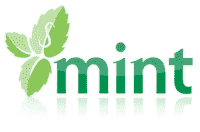
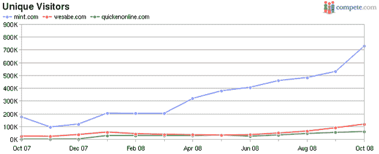

# Mint 加入世界经济论坛，知道你已经减少了星巴克

> 原文：<https://web.archive.org/web/https://techcrunch.com/2008/12/04/mint-joins-the-world-economic-forum-knows-that-youve-cut-back-on-starbucks/>

# 薄荷加入世界经济论坛，知道你已经削减了星巴克

[Mint](https://web.archive.org/web/20230404170619/http://www.mint.com/) ，这个[赢得 TechCrunch40](https://web.archive.org/web/20230404170619/https://techcrunch.com/2007/09/18/mint-wins-techcrunch40-50000-award/) 的个人理财网站，在我们的经济陷入更深的衰退时，仍然继续繁荣。该公司刚刚被瑞士达沃斯的[世界经济论坛](https://web.archive.org/web/20230404170619/http://www.weforum.org/en/index.htm)选为科技先锋——这一荣誉只授予全球 34 家公司(今年科技领域的其他获奖者包括 [Brightcove](https://web.archive.org/web/20230404170619/http://www.brightcove.com/) 、 [Etsy](https://web.archive.org/web/20230404170619/http://www.etsy.com/) 、 [Mojix](https://web.archive.org/web/20230404170619/http://www.mojix.com/) 和 [Slide](https://web.archive.org/web/20230404170619/http://www.slide.com/) ，过去的获奖者包括谷歌、23andMe、Infosys 和 Mozilla)。世界经济论坛是一个旨在帮助改善世界的国际组织，每个 TechPioneer 都是根据其对实现该目标的贡献而入选的。

自从在 TechCrunch40 上推出以来，Mint 已经积累了 620，000 名用户，比其最接近的竞争对手多 4 倍。首席执行官 Aaron Patzer 表示，该网站现在跟踪的消费者总支出超过 1500 亿美元，并且还揭示了一些明显的趋势，显示经济似乎如何影响消费者支出。

根据 Mint 的汇总匿名数据，去年总支出下降了 400 美元，其中一半是在过去两个月里。星巴克的消费下降了 10%左右(星巴克最近报告月收入下降了 7%)。作为预测支出趋势的一种手段，这种数据对企业来说非常有价值——如果 Mint 开始为愿意为总支出付费的企业提供高级服务，不要感到惊讶。

Mint 也越来越移动化。本月早些时候，该网站增加了对账户更新的短信支持(短信 BAL 到 696468 (MYMINT)进行更新)，一个原生的 iPhone 应用程序正在开发中。

