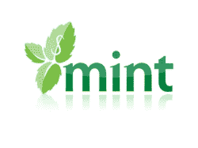
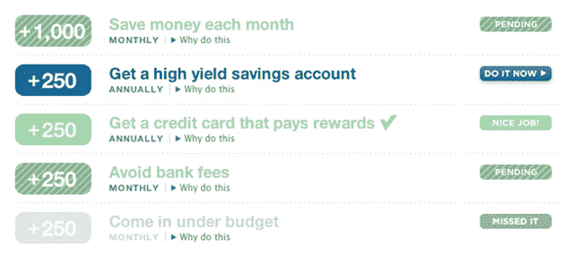
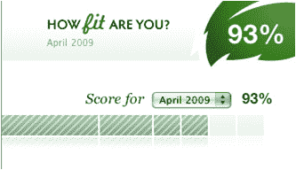

# Mint 把个人理财变成游戏。比听起来要好

> 原文：<https://web.archive.org/web/https://techcrunch.com/2009/04/28/mint-turns-personal-finance-into-a-game-its-not-as-bad-as-it-sounds/>

# Mint 把个人理财变成游戏。这比听起来要好

赢得 2007 年 TechCrunch40 大奖的热门个人理财网站 Mint 正在推出一个名为“财务健康”的新功能，这听起来可能很奇怪，但却为这项服务增加了游戏元素。是的，这听起来可能是一个奇怪的组合——个人理财和娱乐并不完全是两个相辅相成的东西。但对 Mint 来说，这也是一个明智的举动，因为它希望将平凡而又经常令人困惑的财务活动变成一件更容易忍受的事情，同时增加 Mint 在这一过程中的参与。Mint 正在对这一新功能进行为期几周的私人测试，首批 500 名使用他们在 Mint.com 上使用的电子邮件地址向 techcrunch-getfit@mint.com 发送电子邮件的读者将获得访问权。

游戏本身相当简单。它概述了用户在财务健康的道路上应该关注的五个主要原则，包括“花得比赚得少”、“明智地管理信贷和债务”等。这些核心原则中的每一条都有许多与之相关的任务，比如“避免银行费用”和“控制在预算之内”。当你完成任务时，你会得到积分奖励。随着时间的推移，你可以因完成更困难的任务而获得奖励徽章，比如因长期保持 100%的健康状态而被称为“财务大师”。此外，还有一个更切实的好处，那就是你可能比开始时拥有更多的钱。

Mint 研究了 Wii Fit、魔兽争霸和 Nike Fit 等游戏的奖励系统，希望将他们的虚拟财务顾问变成比文本墙更有趣的东西。当然，解决这些任务通常需要用户与 Mint 功能进行交互，或者推荐合作伙伴网站，这意味着 Mint 也可以有效地将游戏货币化。

我敢肯定，许多人最初会对这个游戏持怀疑态度，因为在一个财经网站上，这并不是你首先会想到的事情。但是看似毫无意义的游戏元素仍然很有用:你只需要看一看 foursquare，这是一个相当新的应用程序，因为它类似游戏的性质而很容易上瘾。也就是说，当涉及某种社会因素时，这种积分系统往往会发挥最佳作用——无论是通过与朋友的竞争还是一个聚合的领导委员会。作为一个金融网站，Mint 似乎不太适合这种竞争(取笑我的朋友财务状况比我差有点奇怪)，但我认为游戏方面应该可以。

