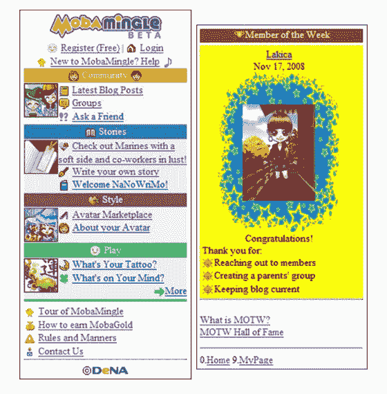
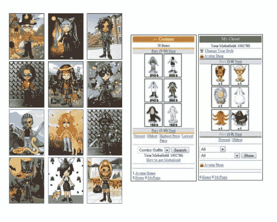
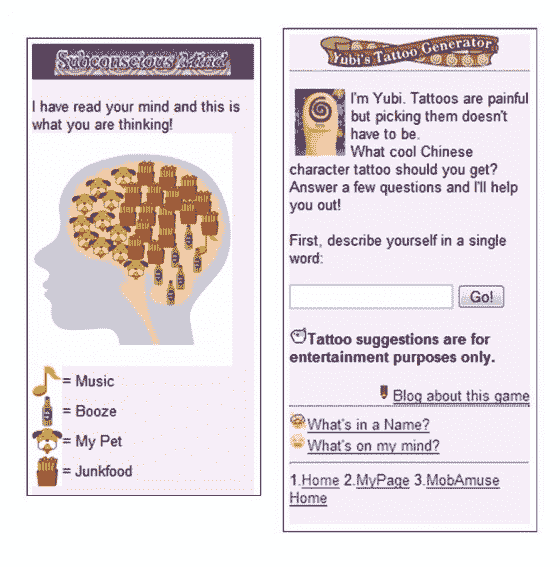

# MobaMingle 为移动社交网络增添了日本特色 

> 原文：<https://web.archive.org/web/https://techcrunch.com/2008/12/02/mobamingle-adds-a-japanese-flavor-to-mobile-social-networks/>

TechCrunch 的我们预计移动社交网络市场将会快速扩张。随着 [iPhone 的成功](https://web.archive.org/web/20221206205920/http://www.mobilecrunch.com/2008/11/10/the-iphone-is-now-the-best-selling-phone-in-the-us/)成为发展的主要催化剂之一，像[脸书移动](https://web.archive.org/web/20221206205920/http://m.facebook.com/)、 [MySpace 移动](https://web.archive.org/web/20221206205920/http://mobile.myspace.com/)、 [Loopt](https://web.archive.org/web/20221206205920/http://loopt.com/) (它甚至提供了 [TechCrunch 品牌的版本](https://web.archive.org/web/20221206205920/http://loopt.beta.techcrunch.com/))、 [aka-aki](https://web.archive.org/web/20221206205920/http://www.aka-aki.com/) 等服务不断涌现。

最近引起我们注意的社交移动网络之一是来自日本的 MobaMingle。MobaMingle 是日本最大的移动社交网络之一 Mobage-town 的国际化版本。MobaMingle 背后的前提是将虚拟世界、社交网络、游戏和移动博客的元素融合成一个集成的概念。

任何新的移动社交网络都面临着从众多竞争者中脱颖而出的严峻挑战。但是，9 月份作为测试版推出的纯移动版 MobaMingle 有一些有利因素。首先，它有日本一家大型母公司的支持，这家公司已经在日本建立了一个非常成功的移动社交网站。

DeNA 投资了 300 万美元启动美国子公司，似乎在日本以外的移动网络发展上下了很大的赌注。该公司表示，它完全致力于手机，对将 MobaMingle 引入固定互联网不感兴趣(然而，日本版本自 7 月起可以通过个人电脑访问，尽管是以一种相当不热心的方式)。

这项服务背后的总部位于圣马特奥的子公司 DeNA Global 甚至试图将日本用手机写作和阅读小说的现象带到西方([【moba story】](https://web.archive.org/web/20221206205920/http://www.mbmgl.com/services.php))。在这一领域，该网站主要与 [Quillpill](https://web.archive.org/web/20221206205920/http://www.quillpill.com/) 竞争，后者[专门专注于手机讲故事](https://web.archive.org/web/20221206205920/http://www.beta.techcrunch.com/2008/06/13/quillpill-a-twitter-for-cell-phone-novelists-500-invites)。

一个与文化和年龄相关的因素可能会成为一个问题，因为它涉及到广泛的、世界范围的目标受众，这就是代表用户的动漫风格的化身。MobaMingle 的日化风格肯定能吸引一部分移动网络用户，但也会将大量讨厌网站设计的人拒之门外。为了最大限度地减少这种危险，MobaMingle 提供了许多面向全球人口更广泛多样性的虚拟形象设计和虚拟物品(不同的发型，不同的脸型，更多的服装选择等)。).就像 MySpace 的移动版一样，MobaMingle 似乎也吸引了一些成年人:DeNA Global 声称大约 10%的用户通过黑莓访问他们的网站。

如果在日本行得通是一个指标的话，对于社交网络来说，被迫追求利基战略并不一定是一个劣势。在日本，Mobage-town 仅在 9 月份就有超过 150 亿的页面浏览量，由 1160 万注册会员产生(DeNA Global 不会透露美国市场的统计数据)。例如，与脸书的移动版相比，MobaMingle 的商业模式并不仅仅基于广告或联盟模式。在日本原版中，用户需要通过点击广告购买虚拟物品来获得 MobaGold(一种虚拟货币)。在美国，用户目前积累 MobaGold 用于网站上的活动，即交友或介绍新成员。

但很快，这项免费服务将通过采用日本 MobaGold 系统额外货币化。此外，售价几美元的虚拟物品将被出售，这一概念(如果用户接受的话)将带来高利润率并扩大用户参与。收入和利润最近有所下降，但在日本，这项服务在 2008 财年第二季度的销售额仍然达到了 4720 万美元。2120 万美元是通过与头像相关的交易产生的。

然而，为了在日本之外复制这一成功，MobaMingle 必须提高网站上现有游戏的质量和数量。没有利用庞大的免费 Flash Lite 游戏库，这是日本版本的基本元素(DeNA Global 认为美国手机缺乏对 Flash Lite 的支持是主要原因)。在目前的形式下，MobaMingle 几乎和没有应用程序的脸书一样，是模仿者相对容易的目标。

【T2

